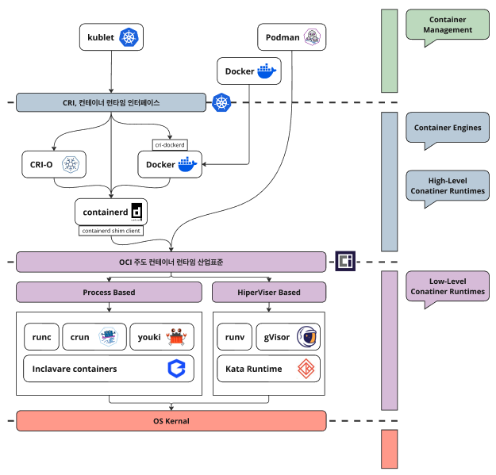
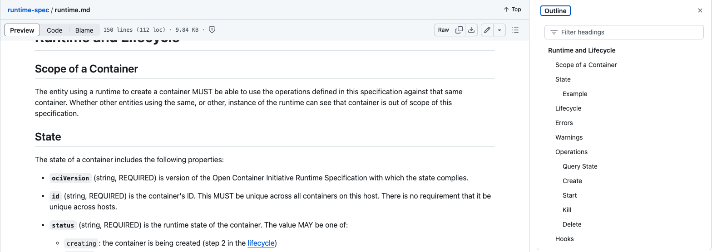

## 서론

과거 API Gateway 작업의 일환으로 SSE 부하 테스트를 진행한 바 있다. 이 과정에서 우리 개발계 k8s ingress gateway 컨테이너의 istio-proxy(envoy-proxy)가 죽는 현상을 목격했다. SSE 연결 수가 일정 범위에 도달할 때 istio-proxy 는 Too Many Open Files 에러메세지를 찍으며 죽었다.

결과적으로는 containerd 를 위한 systemd 의 unit configuration 중 프로세스의 파일 오픈 수를 조정함으로써 해결된 사례이다. k8s 내부 동작에는 큰 관심을 두지 않았던 당시라서 컨테이너 런타임인 containerd 가 무엇인지, 애초에 컨테이너 런타임이란 무엇인지 알고 있는게 없었다. 이 부분을 채우기 위해 가볍게 서치하고 적는다.

## Container Runtime 이란 무엇인가

컨테이너 런타임은 컨테이너의 설정, 실행, 라이프사이클 관리를 책임지는 소프트웨어들을 포괄적으로 지칭하는 용어이다. 일반적으로 컨테이너 관리 소프트웨어와 OS 사이에서 동작하는 소프트웨어들을 일컫는다.



컨테이너 런타임들은 커널 함수로부터 얼마나 추상화되었는지 따라 고수준 컨테이너 런타임 과 저수준 컨테이너 런타임 으로 나눠볼 수 있다. 이 수준을 구분할 때 활용하는 정의는 **CRI(Container Runtime Interface)** 와 **OCI(Open Container Initiative)** **산업표준** 이다.

## CRI - Container Runtime Interface

CRI 이란 무엇인가? CRI 는 [Kubernetes 에서 정의한 컨테이너 런타임 인터페이스](https://github.com/kubernetes/cri-api/blob/master/pkg/apis/runtime/v1/api.proto)이다. 초기 K8S 에서는 docker 를 사용해 컨테이너를 실행했고, 실행 코드는 kublet 에 통합되어 있었다. CRI 는 통합되어있던 컨테이너 설정과 실행 코드를 분리하기 위한 추상화 레이어를 만들 목적으로 탄생하였다. 이런 측면에서 CRI-O 나 Docker 와 같은 엔진들은 고수준 컨테이너 런타임 으로 불리우기도 한다.

이 인터페이스를 토대로 CRI-O, dockershim(k8s 1.24 release 부터 제거됨) 와 같은 컨테이너 런타임 구현체가 나타나기 시작했고, Docker 가 CNCF 에 기증한 컨테이너 런타임 containerd 역시 시간이 지남에 따라 CRI 를 지원하게 된다.

[더보기]

K8S 는 왜 dockershim 을 통한 Docker 런타임 지원을 제거했을까?

shim 이란 이름에서 알 수 있듯이 dockershim 은 K8S 와 Docker 사이의 번역기이고, 임시적인 솔루션이었다. 즉 dockershim 자체는 제거될 것이 예정된 레이어였다.

Docker 자체는 컨테이너 런타임 뿐만 아니라 다양한 컨테이너 관리 기능을 포함한다. 한편 K8S 에게 필요한 것은 그 일부인 컨테이너 런타임, containerd 였다. 시간이 지남에 따라 containerd 는 Docker 로부터 독립했고, CRI plugin 을 통해 인터페이스를 지원한다. 이러한 사양을 토대로 K8S 는 dockershim, Docker 레이어를 없애 네트워크 홉을 줄일 수 있었으며 실질적인 성능향상이 이루었다. 이러한 바탕에서 K8S 는 dockershim 의 지원 중단을 선언하게된다. 
([Kubernetes Containerd Integration Goes GA](https://kubernetes.io/blog/2018/05/24/kubernetes-containerd-integration-goes-ga/#architecture-improvements))

K8S 가 dockershim 의 지원을 중지했지만, 미란티스(구 도커 엔터프라이즈 에디션)와 Docker 는 cri-dockerd 를 필두로 CRI 를 지원할 것을 약속했다. 따라서 여전히 Docker 를 K8S 의 컨테이너 런타임으로 사용할 수 있다. 
([Mirantis to take over support of Kubernetes dockershim | Mirantis](https://www.mirantis.com/blog/mirantis-to-take-over-support-of-kubernetes-dockershim-2))

Kubernetes 에서는 1.30 이후부터 CRI 를 만족하는 런타임을 사용해야하고, K8S 공식 문서는 각각의 맥락에 따라 Container Runtime, CRI Runtime 등으로 언급한다. 언급하는 CRI Runtime 은 아래와 같다.

- [containerd](https://github.com/containerd/containerd/tree/main)

- [CRI-O](https://github.com/cri-o/cri-o)

- Docker with [cri-dockerd](https://github.com/Mirantis/cri-dockerd)

- [MCR(Mirantis Container Runtime, 구 도커 엔터프라이즈 에디션)](https://docs.mirantis.com/mcr) with [cri-dockerd](https://github.com/Mirantis/cri-dockerd)

## OCI - Open Container Initiative

OCI 는 컨테이너 기술의 대두 이후 컨테이너의 산업 표준을 정의하기 위해 2015년 6월 설립된 단체이다. 도커, 구글, 마이크로소프트, IBM 등 주요 벤더들이 모여 설립하였다.

과거에는 컨테이너 기술에서 Docker 가 비공식적 표준이었다. 하지만 OCI 설립 2년 뒤인 2017년 컨테이너 런타임과 컨테이너 이미지의 첫 표준 OCI v1.0 을 발표함으로써 공식적인 표준이 마련되었다.

OCI 는 아래와 같은 3가지 스펙을 정의하고 있다.

- Runtime Specification

- Image Specification

- Distribution Specification

이에 따라 공식 레포지토리들은 아래와 같다. 출처: [http://www.opennaru.com/kubernetes/open-container-initiative/](http://www.opennaru.com/kubernetes/open-container-initiative/)

image-spec
컨테이너 이미지 디스크 포맷
https://github.com/opencontainers/image-spec

image-tools
OCI 이미지 명세에 따라 동작하는 도구 모음
[https://github.com/opencontainers/image-tools](https://github.com/opencontainers/image-tools)

runtime-spec
컨테이너의 설정 방법, 실행 환경, 라이프사이클을 명시
[https://github.com/opencontainers/runtime-spec](https://github.com/opencontainers/runtime-spec)

runtime-tools
OCI 런타임 명세에 따라 동작하는 도구 모음
[https://github.com/opencontainers/runtime-tools](https://github.com/opencontainers/runtime-tools)

runc
OCI 표준에 따라 컨테이너를 생성하고 실행할 수 있는 명령형 도구
[https://github.com/opencontainers/runc](https://github.com/opencontainers/runc)

go-digest
컨테이너 생태계에서 광범위하게 활용될 수 있는 공통 다이제스트(digest) 패키지
[https://github.com/opencontainers/go-digest](https://github.com/opencontainers/go-digest)

selinux
컨테이너에 범용적으로 적용될 있는 SELinux 설정
[https://github.com/opencontainers/selinux](https://github.com/opencontainers/selinux)

이 중 Runtime Specification 에 맞춰 구현된 컨테이너 런타임들이 바로 c 로 구현된 runc 와 rust 로 구현된 youki 와 같은 구현체이며, 저수준 컨테이너 런타임으로 불리운다.

[runtime-spec 의 runtime.md](https://github.com/opencontainers/runtime-spec/blob/main/runtime.md)를 살펴보면 Runtime Specification 을 조금 더 구체적으로 살펴 볼 수 있다.



Outline 에서 볼 수 있듯 Runtime Spec. 은 Container 의 상태를 어떻게 표현해야하는지(State 단락) 그 프로퍼티 명과 필수여부 등을 정의하는가 하면, Lifecycle 단락에서는 컨테이너의 라이프사이클과 각 단계를 설명하는 등 런타임 구현을 위해 지켜야할 사양을 정의하고 있다.

## CGROUP

한 가지 더 알아두어야할 것이 있는데, 바로 cgroup 이다. control groups 로도 읽을 수 있는 cgroup 은 리눅스에서 프로세스들의 CPU, 메모리, 디스크/네트워크 IO 등 자원 사용을 제한하고 격리시키는 커널 기능이다. containerd 와 같은 런타임과 kubelet 은 리눅스에서 자원 할당을 위해 cgroup 을 사용하고, 이를 위해 cgroupfs , systemd 과 같은 cgroup 드라이버를 활용한다.

kubeadm 을 통해 클러스터를 설치했다면 cgroup 드라이버의 default 는 버전에 따라 다를 수 있다. v1.22 이전에는 cgroupfs 이였지만, 이후는 systemd 이다. 일반적으로 아래와 같은 kubectl 로 kubelet 의 cgroup 드라이버를 확인할 수 있다. kubelet 과 컨테이너 런타임의 드라이버가 불일치할 경우 예기치 못한 상황이 발생할 수 있으므로 일치시켜야한다.

```text
kubectl describe cm kubelet-config -n kube-system | grep cgroupDriver
```

또한 containerd 를 통한 runc 를 컨테이너 런타임으로 활용한다면, "/etc/containerd/config.toml" 파일로 cgroup 드라이버를 확인할 수 있다. 이 파일에서아래와 같은 파라미터를 확인한다.

```text
[plugins."io.containerd.grpc.v1.cri".containerd.runtimes.runc]
# ...
  [plugins."io.containerd.grpc.v1.cri".containerd.runtimes.runc.options]
    SystemdCgroup = true
```

## 기타 도움이 될만한 오퍼레이션

### 서비스 프로퍼티 확인

- systemctl show containerd | grep LimitNOFILE

- 다른 systemd 의 프로세스 프로퍼티는 [**링크**](https://manpages.debian.org/bookworm/systemd/systemd.exec.5.en.html#PROCESS_PROPERTIES)를 참조한다.

### 서비스 상태와 설정파일 경로 확인

워커 노드에서 아래와 같은 커맨드로 확인해볼 수 있다.

- systemctl status containerd.service

### 컨테이너 런타임 프로세스의 최대 File Open 제한 조절

systemd 의 파일 오픈 수를 조절하기 위해 로컬에서 아래와 같은 방법을 활용할 수 있었다.

- 방법 1: containerd.service 파일에서 LimitNOFILE, LimitNOFILESOFT 값을 직접 수정

- 방법 2: systemctl set-property containerd.service LimitNOFILE=65535
