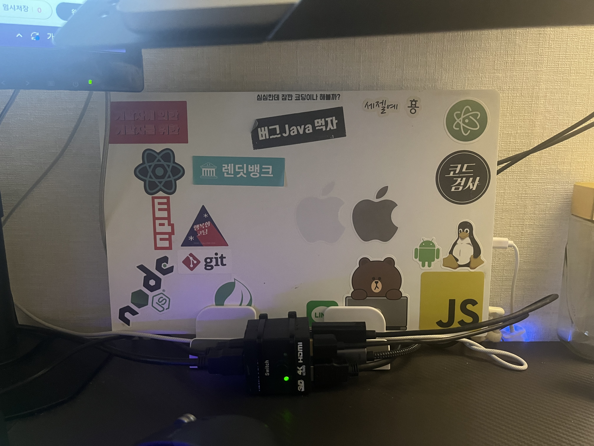
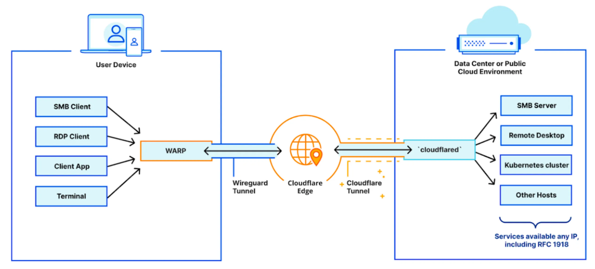
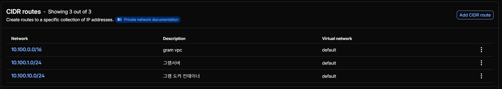
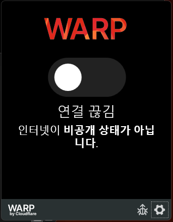
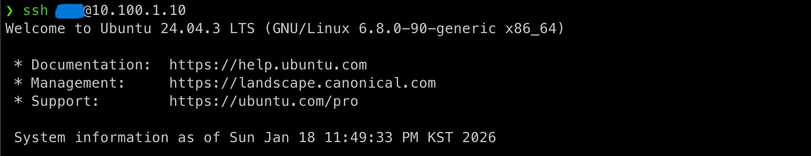

집에 구성한 리눅스 서버를 외부에서 접속하기 위한 방법 중 하나를 소개한다. 방식은 여러가지겠으나, 아래와 같은 기준으로 Cloudflare Tunnel을 선택했다.

1. 유지비용이 없거나 저렴한가
2. 설정이 비교적 간단하고 레퍼런스가 충분한가
3. 공유기에 물린 공인 IP를 가릴 수 있는가

필자는 집 서버에 도커 이미지를 올려둘 레지스트리와 친구들과 쓰는 게임 서버 등을 올려 활용하고 있다. 따라서 문제가 발생했을 때 카페나 외부에 있더라도 집에 구성해둔 서버를 자유롭게 접근할 필요가 있었다. **클라우드플레어의 터널은 현재로써 무료**이고, "터널" 이란 이름에 걸맞게 공인 IP를 입력하지 않고도 SSH 접속이 가능하다. 쁘띠 실험실들을 외부에서 접속하기 위한 좋은 선택인 것 같아서 방법을 공유한다.


_2013년에 사용하던 그램 노트북에 우분투 서버를 설치하고 쓰고 있다. 스티커는 조금 민망한데... 양해를 구한다._

개념적으로 헷갈릴 수 있는 부분이 있어 클라우드플레어 터널에 대한 간단한 개요만 짚고 How To 를 설명한다.

## Cloudflare Tunnel 개요

공개 IP 주소 없이 리소스를 Cloudflare에 연결 가능한 방법으로 소개된다. ([공식문서: 클라우드플레어 터널](https://developers.cloudflare.com/cloudflare-one/networks/connectors/cloudflare-tunnel/) 참조) 서버 내 경량 데몬(`cloudflared`)을 설치하여 클라우드플레어 글로벌 네트워크로의 전용 연결을 생성한다. 즉 이 서비스를 사용하면 트래픽은 클라우드플레어를 경유한다.



우리가 알아두어야 할 컴포넌트들은 아래와 같다.

1. `cloudflared`: 서버에 설치할 데몬
2. Cloudflare WARP: 유저 디바이스에 설치할 클라이언트
3. 클라우드플레어 네트워크: WARP가 발신한 트래픽을 `cloudflared`로 라우팅한다

이 컴포넌트를 기준으로 우리가 할 것은 다음과 같다.

1. 클라우드플레어에 가입하고, Zero Trust 팀을 구성
2. 서버에 `cloudflared`를 설치하고 CIDR 라우팅 설정
3. 클라이언트 기기에 WARP 설치와 기기 등록
4. SSH 라우팅 설정

서버는 Ubuntu 24.04.3 LTS로 전제했다.

## 클라우드플레어 Zero Trust 생성

클라우드플레어 터널은 클라우드플레어 Zero Trust 서비스의 하위 기능이므로, Zero Trust 팀 생성이 필요하다. "클라우드플레어 Zero Trust" 서비스는 일종의 VPN 확장판이라 이해할 수 있다.

1. [https://dash.cloudflare.com/sign-up](https://dash.cloudflare.com/sign-up) 링크를 통해 회원가입을 먼저 진행한다.
2. 대시보드의 네비게이션에서 "Zero Trust"를 선택한다.
3. 리디렉션된 페이지의 안내에 따른다.
   1. 팀 이름 입력, 플랜 선택, 카드 등록이 뒤따른다.

이후 [https://one.dash.cloudflare.com](https://one.dash.cloudflare.com) (클라우드플레어 원 대시보드)에서 해당 팀의 대시보드에 접근할 수 있다.

## 클라우드플레어 터널 설치와 라우팅 설정

[https://one.dash.cloudflare.com](https://one.dash.cloudflare.com) 대시보드에서 다음 순서로 진행한다.

1. `Network > Connectors` 메뉴로 페이지에 접근한다.
2. "Add a tunnel" 버튼을 통해 터널 데몬 설치와 설정을 시작한다.
   1. 터널 타입은 Cloudflared로 선택하고 다음으로 넘어간다.
   2. 터널 명을 입력하고 터널을 생성한다.
3. 커넥터(`cloudflared`) 설치 지시사항을 따르고 다음으로 넘어간다.
   1. 서버의 환경을 각자의 환경에 맞게 선택한 후 설치 스크립트를 실행한다.
   2. 플랫폼에 따라 설치 이외의 서비스 등록 스크립트 등이 따르므로 주의한다.
4. 이후 라우팅을 설정한다.
   1. 3개의 탭, `Published Applications`, `Hostname routes`, `CIDR`가 존재하지만 이 문서에서는 `CIDR`만 활용한다.
   2. `CIDR` 탭을 누르고 `CIDR` 라우트를 추가한다.
      1. 이때 설정한 네트워크 범위는 터널로 라우팅된다.
      2. 예를 들어 `10.100.1.0/24`로 범위를 택할 경우, WARP가 발신하는 `10.100.1.1`로의 트래픽은 데몬이 설치된 서버로 라우팅된다.
      3. 다른 VPN을 사용할 경우 네트워크 범위가 겹칠 수 있어 주의가 필요하다. 예컨대 AWS의 사설 네트워크 범위, 로컬 도커의 사설 네트워크 범위가 대표적이다.

다음은 필자의 라우팅 설정이다. 설정 시 참고할 수 있을 것 같다.



## 클라이언트 기기에 WARP 설치와 기기 등록

원격 접속할 클라이언트 기기에서 [https://one.dash.cloudflare.com](https://one.dash.cloudflare.com) 대시보드에 접속한다.

1. `Team & Resources > Devices` 메뉴로 페이지에 접근한다.
2. `Add a device` 버튼을 통해 WARP 설치를 진행한다.
3. 이후 절차는 Default 값 설정으로 충분하다.

WARP는 일종의 VPN 클라이언트로 이해하면 쉽다. 이제 설치된 WARP에 로그인을 시켜주자. 맥의 경우 메뉴바, 윈도우의 경우 시스템 트레이에서 WARP 아이콘을 클릭하고 설정을 진행한다.



1. 아이콘 클릭 후 나타난 약관 동의를 마치고, 우측 하단 톱니바퀴를 클릭한다. 맥의 경우 우측 상단에 있다.
2. 기본 설정을 클릭한다.
3. 설정에서 계정 메뉴를 선택한다.
4. 우측 하단의 `Cloudflare Zero Trust`로 로그인 버튼을 통해 로그인을 진행한다.
5. 약관 동의 등을 진행하면 팀 이름 입력란이 나타나며, 이때 상기에서 생성한 팀 이름을 입력한다.
6. 팀 이름을 입력하면 Cloudflare Access 창에 리다이렉트되며, 이때 가입한 이메일을 입력한다.
   1. 만약 페이지 오류가 발생한 경우, 위 WARP 설치 절차에서 자동으로 생성되는 `Access controls`의 `Policies`를 설정하지 않은 경우일 수 있다. `Access controls > Policies` 메뉴에서 이메일 정책을 추가하여 해결할 수 있다.
7. 이메일로 받은 승인코드를 입력해 로그인을 완료한다.

이제 WARP를 켜면, 설정한 CIDR로의 트래픽은 모두 원격 서버로 라우팅된다.

## SSH 연결을 위한 루프백의 링크 생성하기

이제 서버의 루프백 네트워크 인터페이스에 IP 주소를 추가해 CIDR 라우팅 시 트래픽이 서버 루프백으로 라우팅될 수 있도록 하자.

CIDR 라우팅이 `10.100.1.0/24`라면 홈 서버에서 다음 명령어를 실행한다.

```bash
sudo ip addr add 10.100.1.10/32 dev lo
```

상기 명령어를 통해 루프백에 주소를 추가한다. 아래 명령어로 `lo` 인터페이스 하위에 주소가 추가된 것을 확인할 수 있다.

```bash
ip addr show
```

클라이언트에서는 다음 명령어로 SSH 세션을 생성할 수 있다.

```bash
ssh <계정>@10.100.1.10
```



## 끝으로

홈 서버에 SSH 접속하기 위한 Cloudflare Tunnel 사용법을 아주 최소한의 설정만 소개하여 설명하였다. 필요에 따라 서비스의 사용 방식은 다양하다. 각자 입맛에 맞게 조율하여 활용하실 때에 도움이 되길 바란다.
