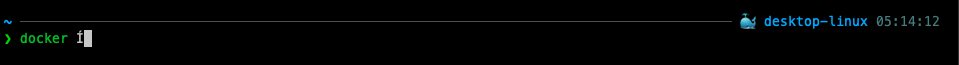

Docker를 여러 환경에서 쓰다 보면 지금 어떤 context를 보고 있는지 헷갈릴 때가 있다.
특히 로컬 Docker 환경과 원격 Docker host를 번갈아 쓰면 더 그렇다.

`zsh + powerlevel10k(p10k)` 환경에서 현재 Docker context를 프롬프트에 보이도록 설정해서 쓰고 있다.
이 글에서는 그 설정 방법을 정리한다.

## 현재 Docker context 확인하기

먼저 터미널에서 현재 context가 어떻게 보이는지 확인한다.

```bash
docker context show
```

전체 목록은 이렇게 볼 수 있다.

```bash
docker context ls
```

예를 들면 현재 context가 `desktop-linux` 혹은 `default`처럼 출력된다.



## p10k에서 Docker context 세그먼트 붙이기

Powerlevel10k에는 `kubecontext`처럼 잘 알려진 세그먼트가 있지만, 내가 쓰는 `docker_context`는 그 패턴을 참고해서 붙인 커스텀 세그먼트다.
그래서 `~/.p10k.zsh`에서 오른쪽 프롬프트 요소에 `docker_context`를 넣고, 아래에서 설명하는 `prompt_docker_context` 함수도 같이 정의해둬야 한다.

```zsh
typeset -g POWERLEVEL9K_RIGHT_PROMPT_ELEMENTS=(
  status
  command_execution_time
  ...
  docker_context
  kubecontext
  terraform
  ...
  time
  newline
)
```

이 이름을 프롬프트 요소에 넣고 같은 이름의 함수를 정의하면 프롬프트에 Docker context를 표시할 수 있다.

## Docker 명령을 칠 때만 보이게 하는 설정

```zsh
typeset -g POWERLEVEL9K_DOCKER_CONTEXT_SHOW_ON_COMMAND='docker|docker-compose|docker-buildx|docker-buildx bake|docker buildx|docker compose'
```

이 옵션도 같이 넣어두면 `docker`, `docker compose` 같은 명령을 입력할 때만 Docker context가 보이도록 제한할 수 있다.

## 항상 보이게 하려면

아래 줄을 삭제하거나 주석 처리한다.

```zsh
typeset -g POWERLEVEL9K_DOCKER_CONTEXT_SHOW_ON_COMMAND='docker|docker-compose|docker-buildx|docker-buildx bake|docker buildx|docker compose'
```

수정 후 설정을 다시 불러온다.

```bash
source ~/.p10k.zsh
```

또는 새 셸을 열어도 된다.

이제 Docker context가 프롬프트에 항상 표시된다.

## 커스텀 세그먼트로 표시하는 방법

이 부분은 `kubecontext` 같은 `p10k` 세그먼트 동작 방식을 참고해서 직접 만든 커스텀 함수다.
현재 Docker context를 읽어서 프롬프트에 표시한다.

```zsh
function prompt_docker_context() {
  (( $+commands[docker] )) || return

  local docker_context
  docker_context="$(docker context show 2>/dev/null)" || return
  [[ -n $docker_context ]] || return

  p10k segment -f 39 -i '🐳' -t "$docker_context"
}
```

이 함수는 현재 Docker context를 읽어서 `🐳 desktop-linux` 같은 형태로 출력한다.

Powerlevel10k에서 사용자 정의 세그먼트를 쓸 때는 세그먼트 이름과 함수 이름이 연결된다.
예를 들어 프롬프트 요소에 `docker_context` 대신 커스텀 이름을 쓰고 싶다면 다음처럼 구성할 수 있다.

```zsh
typeset -g POWERLEVEL9K_RIGHT_PROMPT_ELEMENTS=(
  ...
  my_docker_context
  ...
)

function prompt_my_docker_context() {
  (( $+commands[docker] )) || return

  local docker_context
  docker_context="$(docker context show 2>/dev/null)" || return
  [[ -n $docker_context ]] || return

  p10k segment -f 39 -i '🐳' -t "$docker_context"
}
```

즉 `docker_context`라는 이름을 프롬프트 요소에 넣었다면 `prompt_docker_context` 함수를 같이 정의해야 실제로 보인다.

## 정리

실제로 중요한 건 세 가지다.

1. `POWERLEVEL9K_RIGHT_PROMPT_ELEMENTS`에 `docker_context`가 들어 있어야 한다.
2. `prompt_docker_context` 함수가 정의되어 있어야 한다.
3. 항상 보이게 하려면 `POWERLEVEL9K_DOCKER_CONTEXT_SHOW_ON_COMMAND`를 제거해야 한다.

즉, Docker context가 프롬프트에 안 보인다면 보통 아래 둘 중 하나다.

- `docker_context` 세그먼트가 빠져 있음
- `prompt_docker_context` 함수가 없음
- `SHOW_ON_COMMAND` 옵션 때문에 조건부 표시만 되고 있음

## 마무리

Docker context는 평소엔 사소해 보여도, 잘못된 환경에 붙은 상태로 명령을 치면 꽤 위험할 수 있다.
특히 원격 context를 쓰는 경우라면 프롬프트에 항상 보이게 해두는 게 안전하다.

지금은 `p10k`에서 Docker context를 항상 표시하도록 두고 쓰고 있다.
작은 설정 하나지만, 실수 방지에는 꽤 도움이 된다.
