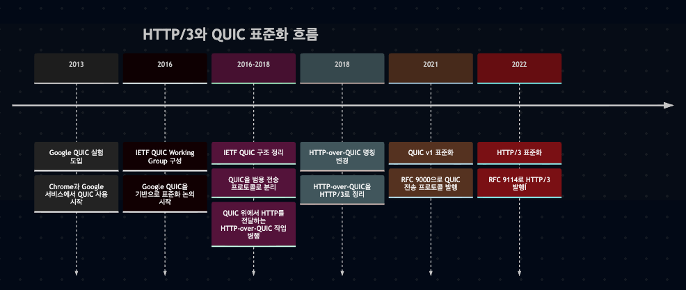
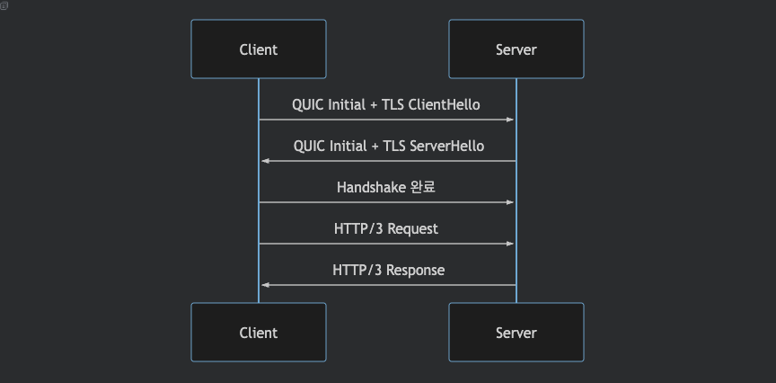
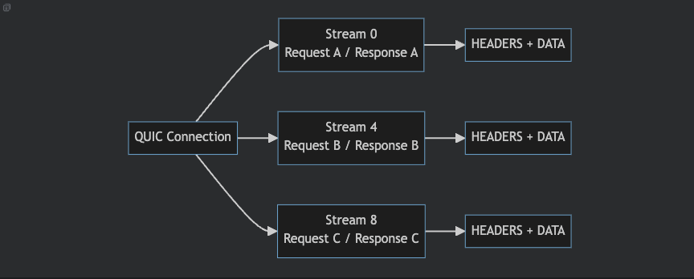
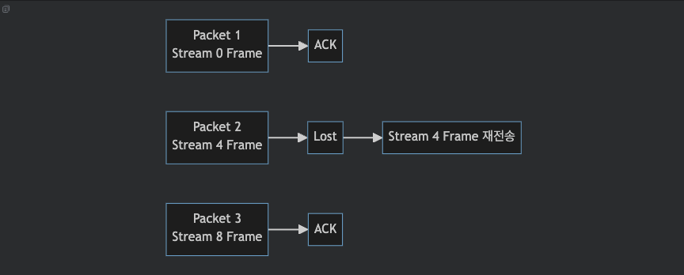
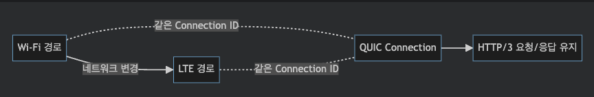
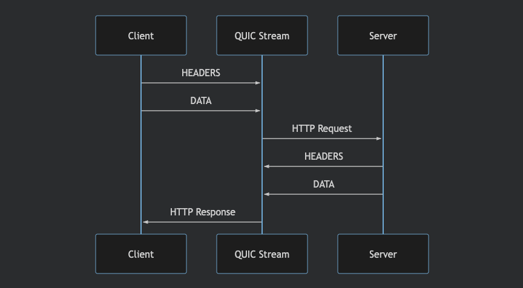

## 개요

HTTP/3는 HTTP의 의미론은 유지하면서, 전송 계층을 TCP가 아닌 QUIC 위로 옮긴 HTTP의 세 번째 주요 버전이다. 즉 메서드, 상태 코드, 헤더와 같은 HTTP 모델은 변경하지 않고, 연결 방식의 기반을 QUIC으로 바꾼 프로토콜이다.

이 문서는 HTTP/3의 개념과 등장 배경, 동작 방식, 기반 기술인 QUIC을 정리하고, 기존 HTTP 버전들과의 차이를 함께 살펴보기 위한 문서이다.

구체적인 HTTP/3 명세는 [RFC 9114](https://datatracker.ietf.org/doc/html/rfc9114)를 참고할 수 있고, 후술할 QUIC 전송 프로토콜은 [RFC 9000](https://datatracker.ietf.org/doc/html/rfc9000)을 참고할 수 있다.

## 목차
- [등장 배경](#%EB%93%B1%EC%9E%A5-%EB%B0%B0%EA%B2%BD)
- [TCP의 한계](#tcp%EC%9D%98-%ED%95%9C%EA%B3%84)
- [QUIC의 등장](#quic%EC%9D%98-%EB%93%B1%EC%9E%A5)
- [생태계의 반응](#%EC%83%9D%ED%83%9C%EA%B3%84%EC%9D%98-%EB%B0%98%EC%9D%91)
- [HTTP/3 기능별 메커니즘](#http3-%EA%B8%B0%EB%8A%A5%EB%B3%84-%EB%A9%94%EC%BB%A4%EB%8B%88%EC%A6%98)
- [QUIC 계층의 역할](#quic-%EA%B3%84%EC%B8%B5%EC%9D%98-%EC%97%AD%ED%95%A0)
- [보안: 연결 수립](#%EB%B3%B4%EC%95%88-%EC%97%B0%EA%B2%B0-%EC%88%98%EB%A6%BD)
- [스트림: 멀티플렉싱](#%EC%8A%A4%ED%8A%B8%EB%A6%BC-%EB%A9%80%ED%8B%B0%ED%94%8C%EB%A0%89%EC%8B%B1)
- [신뢰성: 손실 복구](#%EC%8B%A0%EB%A2%B0%EC%84%B1-%EC%86%90%EC%8B%A4-%EB%B3%B5%EA%B5%AC)
- [연결 관리: 연결 마이그레이션](#%EC%97%B0%EA%B2%B0-%EA%B4%80%EB%A6%AC-%EC%97%B0%EA%B2%B0-%EB%A7%88%EC%9D%B4%EA%B7%B8%EB%A0%88%EC%9D%B4%EC%85%98)
- [HTTP/3 연결과 메시지 처리](#http3-%EC%97%B0%EA%B2%B0%EA%B3%BC-%EB%A9%94%EC%8B%9C%EC%A7%80-%EC%B2%98%EB%A6%AC)
- [연결 발견](#%EC%97%B0%EA%B2%B0-%EB%B0%9C%EA%B2%AC)
- [헤더와 메시지 전달](#%ED%97%A4%EB%8D%94%EC%99%80-%EB%A9%94%EC%8B%9C%EC%A7%80-%EC%A0%84%EB%8B%AC)
- [기존 HTTP 버전과의 차이](#%EA%B8%B0%EC%A1%B4-http-%EB%B2%84%EC%A0%84%EA%B3%BC%EC%9D%98-%EC%B0%A8%EC%9D%B4)
- [마무리](#%EB%A7%88%EB%AC%B4%EB%A6%AC)

## 등장 배경

### TCP의 한계

HTTP/3가 등장한 직접적인 이유는 HTTP/2가 TCP 위에서 동작한다는 점에 있다. HTTP/2의 멀티플렉싱은 한 TCP 연결 위에서 여러 요청과 응답을 동시에 처리할 수 있게 했지만, 여전히 다음과 같은 문제가 남아 있었다.
- HOL(Head-of-Line) Blocking: 패킷 손실 시 같은 TCP 연결의 다른 스트림까지 영향
- 연결 지연: TCP 연결 수립과 TLS 협상 과정에서 왕복 지연 발생
- 연결 유지: 모바일 환경에서 네트워크 변경 시 재연결 필요

이 문제를 줄이기 위한 출발점은 Google이 2013년 Chrome과 자사 서비스에 실험적으로 도입한 QUIC이다.

### QUIC의 등장

QUIC(Quick UDP Internet Connections)은 UDP 위에서 동작하면서도 신뢰성 있는 전송, 스트림 멀티플렉싱, 암호화, 빠른 연결 수립을 함께 제공하려는 시도였다. Google QUIC은 이후 IETF 표준화 과정에서 범용 전송 프로토콜로 재정리되었고, 그 위에서 HTTP를 전달하는 HTTP-over-QUIC 작업이 함께 진행되었다. 이 HTTP-over-QUIC 작업은 2018년 IETF 논의 과정에서 HTTP/3라는 이름으로 정리되었다.

### 생태계의 반응

HTTP/3 지원은 브라우저와 대형 서비스, CDN에서 먼저 확산되었다. Google은 Chrome과 자사 서비스를 통해 QUIC을 먼저 실험했고,
Cloudflare 같은 CDN은 2019년부터 Chrome, Firefox와 함께 HTTP/3 지원을 공개적으로 확산시켰다.

이후 서버, 프록시, 네트워크 라이브러리 구현체들이 IETF QUIC과 HTTP/3를 지원하기 시작했다. 반면 언어 런타임과 표준 API의 지원은 더 늦게 따라왔다. Java는 JDK 26에서 `java.net.http.HttpClient`의 HTTP/3 지원을 정식 릴리스했다. Python과 Kotlin은 언어 표준 라이브러리 차원의 HTTP/3 지원보다는 실행 환경과 서드파티 라이브러리의 지원 여부에 따라 사용 방식이 결정된다. Python은 `aioquic` 같은 구현체를 통해 QUIC과 HTTP/3를 사용할 수 있고, Kotlin 계열은 JVM, Ktor, Netty, OkHttp 같은 실행 환경과 라이브러리의 영향을 받는다.

## HTTP/3 기능별 메커니즘

### QUIC 계층의 역할

HTTP/3에서 QUIC은 TCP와 TLS가 나누어 맡던 역할을 함께 담당한다.
QUIC의 역할은 다음 네 가지로 정리할 수 있다.

#### 보안: 연결 수립

HTTP/3 연결은 TCP 연결을 만든 뒤 TLS를 올리는 방식이 아니라, QUIC 연결 수립 과정 안에서 TLS 1.3 핸드셰이크를 함께 처리한다. 따라서 기존 TCP + TLS 조합보다 왕복 지연을 줄일 수 있다.

#### 스트림: 멀티플렉싱

HTTP/3의 요청과 응답은 QUIC 스트림 위에서 전달된다. QUIC 연결은 하나의 논리적 연결이지만, 그 안에는 여러 개의 독립적인 스트림이 존재할 수 있다. 각 스트림은 고유한 Stream ID를 가지며, HTTP/3는 보통 하나의 요청-응답 쌍을 하나의 스트림에 매핑한다.

각 스트림은 독립적인 순서와 흐름 제어를 가진다. 따라서 한 스트림에서 패킷 손실이나 지연이 발생해도, 다른 스트림은 가능한 범위에서 계속 처리될 수 있다.

HTTP/2도 하나의 TCP 연결에서 여러 스트림을 처리했지만, TCP 계층에서는 모든 바이트가 하나의 순서로 복원되어야 했다. 반면 HTTP/3는 QUIC이 스트림 단위로 데이터를 관리하므로, 특정 스트림의 손실이 다른 스트림 전체를 막는 상황을 줄일 수 있다.

#### 신뢰성: 손실 복구

QUIC 계층은 UDP 위에서 직접 손실 감지와 재전송을 처리한다. UDP 자체는 ACK나 재전송을 제공하지 않지만, QUIC 계층은 각 packet에 번호를 부여하고 수신 상태를 ACK frame으로 교환한다. 송신자는 ACK frame을 통해 확인되지 않은 packet을 손실로 판단하고, 그 안에 포함되어 있던 데이터를 다시 전송한다.

중요한 점은 QUIC packet과 QUIC stream이 같은 단위가 아니라는 것이다. packet은 네트워크 전송과 손실 감지의 단위이고, stream은 애플리케이션 데이터의 순서와 흐름 제어 단위이다.

따라서 특정 packet이 손실되면 그 packet에 포함된 stream frame은 재전송되지만, 다른 stream의 데이터까지 같은 순서로 대기할 필요는 없다. 이 구조 때문에 HTTP/2 over TCP에서 문제가 되었던 연결 전체 단위의 HOL Blocking을 완화할 수 있다.

#### 연결 관리: 연결 마이그레이션

QUIC은 IP 주소나 포트가 바뀌어도 연결을 식별할 수 있도록 Connection ID를 사용한다. 이 덕분에 모바일 환경에서 Wi-Fi에서 LTE로 전환되는 상황처럼 네트워크 경로가 바뀌어도 같은 논리적 연결을 이어갈 수 있다.

### HTTP/3 연결과 메시지 처리

HTTP/3는 QUIC이 제공하는 연결과 스트림 위에서 HTTP 요청과 응답을 구성한다. 이 과정에는 HTTP/3 사용 가능 여부를 찾는 연결 발견과, 요청/응답을 프레임으로 나누어 전달하는 방식이 포함된다.

#### 연결 발견

클라이언트가 처음부터 HTTP/3를 사용할 수 있다고 확신하기는 어렵다.
그래서 실제 연결에서는 다음 방식들이 사용된다.
- Alt-Svc: 기존 HTTP/1.1 또는 HTTP/2 응답을 통해 HTTP/3 사용 가능 여부를 알림
- HTTPS DNS 레코드: DNS 단계에서 HTTP/3 사용 가능 정보를 전달
- 직접 시도: 클라이언트가 HTTP/3 연결을 먼저 시도하고 실패하면 이전 버전으로 전환

#### 헤더와 메시지 전달

HTTP/3는 HTTP/2와 비슷한 바이너리 프레이밍 구조를 사용한다. 다만 HTTP/2 프레임을 그대로 쓰는 것이 아니라,
QUIC 스트림 위에서 HTTP/3 전용 프레임을 사용한다.

대표적인 프레임은 다음과 같다.

`HEADERS`
요청/응답 헤더 전달

`DATA`
요청/응답 본문 전달

`SETTINGS`
연결 단위 설정 교환

`GOAWAY`
연결 종료 또는 graceful shutdown 알림

하나의 요청은 대체로 다음 흐름으로 전달된다.

이때 헤더는 QPACK을 사용해 압축한다.

## 기존 HTTP 버전과의 차이

HTTP 버전별 차이를 정리하면 아래와 같다.

| 항목 | HTTP/1.1 | HTTP/2 | HTTP/3 |
| --- | --- | --- | --- |
| 전송 기반 | TCP | TCP | QUIC over UDP |
| 보안 | TLS를 별도로 구성 | TLS를 TCP 위에 별도로 구성 | TLS 1.3이 QUIC에 통합 |
| 요청 처리 | 연결당 요청을 순차 처리하거나 여러 TCP 연결 사용 | HTTP/2 스트림을 하나의 TCP 연결에 다중화 | QUIC 스트림을 하나의 QUIC 연결에 다중화 |
| HOL Blocking | 요청 단위 또는 TCP 연결 단위에서 발생 가능 | TCP 패킷 손실 시 연결 전체에 영향 가능 | 스트림 단위 처리로 영향 완화 |
| 연결 마이그레이션 | IP/포트 변경 시 연결 유지 어려움 | IP/포트 변경 시 연결 유지 어려움 | Connection ID로 연결 유지 가능 |
| 헤더 압축 | 없음 | HPACK | QPACK |

## 마무리

HTTP/3 에 대한 내용을 정리하면 아래와 같다.
- HTTP/3는 HTTP 모델을 유지한 채 TCP에서 QUIC 으로 옮긴 버전
- HTTP/2 에서 남아 있던 연결 지연 문제, 유지 문제, HOL Blocking 문제를 개선
- 주요 생태계에서는 이에 상응하는 구현체 및 환경을 제공하고 있음
