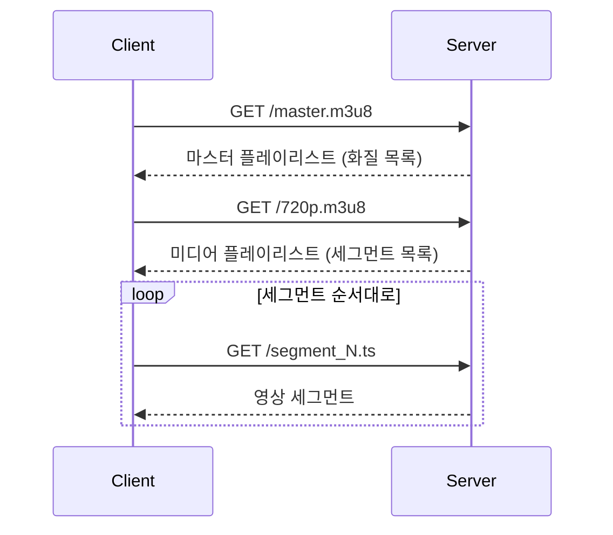
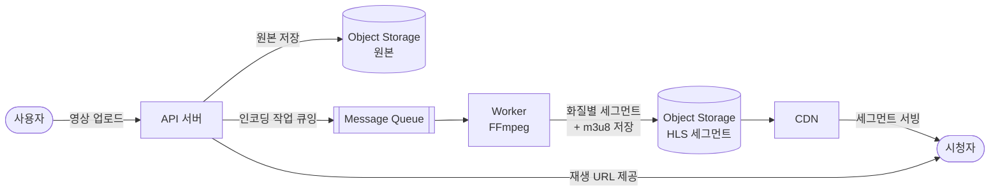
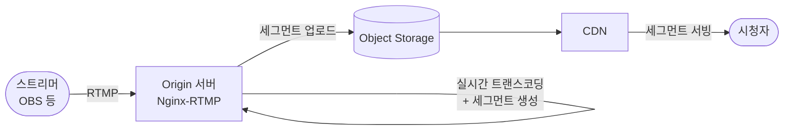

## 개요

유튜브에서 영상을 재생할 때 우하단에 화질 옵션이 있다. 네트워크가 느려지면 자동으로 화질이 낮아지고, 다시 빨라지면 올라온다. 이 동작의 기반이 HTTP 적응형 스트리밍이다.

1편에서 다룬 SSE와 WebSocket이 서버가 데이터를 밀어넣는 방식이었다면, HLS와 DASH는 반대로 영상을 작은 세그먼트로 잘라두고 클라이언트가 당겨가는 방식이다. 연결을 열어두지 않고 일반 HTTP 요청으로 세그먼트를 하나씩 받아 재생한다.


이 글은 HLS와 DASH가 어떻게 동작하는지, 그리고 네트워크 상황에 따라 화질이 어떻게 전환되는지를 정리한다.

## HLS (HTTP Live Streaming)

Apple이 2009년 iOS 3.0과 함께 도입한 HTTP 기반 스트리밍 프로토콜이다. Safari와 iOS에서 기본 지원되며, 현재는 대부분의 플랫폼에서 사용 가능하다.

핵심 아이디어는 단순하다. 영상을 일정 길이(보통 2~10초)의 세그먼트 파일로 잘라두고, 그 목록을 플레이리스트 파일로 제공한다. 클라이언트는 플레이리스트를 읽어 세그먼트를 순서대로 요청해 이어붙여 재생한다.

### 매니페스트 — m3u8

HLS의 플레이리스트 포맷은 `.m3u8`이다. 두 종류가 있다.

**마스터 플레이리스트** — 화질별 스트림 목록을 담는다.

```
#EXTM3U
#EXT-X-STREAM-INF:BANDWIDTH=800000,RESOLUTION=640x360
360p.m3u8
#EXT-X-STREAM-INF:BANDWIDTH=2000000,RESOLUTION=1280x720
720p.m3u8
#EXT-X-STREAM-INF:BANDWIDTH=5000000,RESOLUTION=1920x1080
1080p.m3u8
```

**미디어 플레이리스트** — 실제 세그먼트 파일 목록을 담는다.

```
#EXTM3U
#EXT-X-VERSION:3
#EXT-X-TARGETDURATION:6

#EXTINF:6.0,
segment_0.ts
#EXTINF:6.0,
segment_1.ts
#EXTINF:6.0,
segment_2.ts
#EXT-X-ENDLIST
```

`#EXT-X-ENDLIST`가 없으면 라이브 스트리밍이다. 클라이언트는 플레이리스트를 주기적으로 다시 요청해 새 세그먼트가 추가됐는지 확인한다.

### 세그먼트 요청과 재생 흐름



클라이언트는 세그먼트를 버퍼에 미리 쌓아두면서 재생하기 때문에, 세그먼트 하나를 받는 동안 이미 받아둔 세그먼트를 재생한다.

최근에는 `.ts` 대신 fMP4(fragmented MP4)도 지원하지만(HLS v6+), `.ts`가 여전히 널리 쓰인다.

### ABR — 네트워크에 따라 화질 전환하기

Adaptive Bitrate Streaming. 클라이언트가 세그먼트를 내려받는 속도를 모니터링해 다음 세그먼트의 화질을 결정한다.

- 네트워크 속도가 충분하면 → 상위 화질 플레이리스트의 세그먼트 요청
- 네트워크가 느려지면 → 하위 화질로 전환
- 버퍼 여유가 클수록 더 적극적으로 고화질 시도

화질 선택 로직은 클라이언트(플레이어)에 있다. 서버는 화질별 세그먼트를 미리 인코딩해 제공하기만 하면 된다. 덕분에 서버는 단순 HTTP 파일 서버로 충분하고, CDN과 결합하기도 쉽다.

## DASH (Dynamic Adaptive Streaming over HTTP)

2012년 ISO/IEC 표준으로 제정된 개방형 적응형 스트리밍 프로토콜이다. HLS가 Apple 독자 규격인 반면 DASH는 특정 회사에 종속되지 않는다. YouTube, Netflix가 주력으로 사용한다.

동작 방식은 HLS와 거의 같다. 매니페스트를 통해 화질별 세그먼트 목록을 제공하고, 클라이언트가 ABR로 화질을 선택하며 세그먼트를 요청한다. 차이는 매니페스트 형식과 세그먼트 포맷에 있다.

DASH의 매니페스트는 `.mpd`(Media Presentation Description) 파일이며 XML 형식이다.

```xml
<MPD type="static" mediaPresentationDuration="PT10M">
  <Period>
    <AdaptationSet mimeType="video/mp4">
      <Representation id="360p" bandwidth="800000" width="640" height="360">
        <SegmentTemplate media="360p_$Number$.m4s" initialization="360p_init.mp4"/>
      </Representation>
      <Representation id="720p" bandwidth="2000000" width="1280" height="720">
        <SegmentTemplate media="720p_$Number$.m4s" initialization="720p_init.mp4"/>
      </Representation>
    </AdaptationSet>
  </Period>
</MPD>
```

### HLS와의 차이

| | HLS | DASH |
|---|---|---|
| 개발 주체 | Apple | MPEG (ISO 표준) |
| 매니페스트 | .m3u8 (텍스트) | .mpd (XML) |
| 세그먼트 포맷 | .ts / fMP4 | fMP4 / WebM |
| iOS 기본 지원 | O | X (별도 플레이어 필요) |
| 브라우저 지원 | Safari 기본, 타 브라우저 별도 | MSE 경유로 대부분 지원 |

iOS를 지원해야 하는 서비스라면 HLS가 필수다. 그 외 환경에서는 DASH가 표준에 가깝다. 실제로 YouTube처럼 규모 있는 서비스는 두 포맷을 모두 제공해 각 클라이언트 환경에 맞게 제공한다.

## CDN과의 결합

HLS와 DASH 세그먼트는 일반 HTTP 응답이기 때문에 CDN에 자연스럽게 캐싱된다. 세그먼트 파일은 한 번 생성되면 내용이 바뀌지 않는 정적 파일이므로 캐시 적중률이 매우 높다.

주의할 부분은 플레이리스트 파일이다. 라이브 스트리밍에서 미디어 플레이리스트는 새 세그먼트가 추가될 때마다 갱신되므로, TTL을 세그먼트 길이 정도로 짧게 설정해야 클라이언트가 최신 목록을 받아간다.

```
세그먼트(.ts):   Cache-Control: max-age=31536000  ← 변하지 않으므로 길게
플레이리스트:    Cache-Control: max-age=6          ← 세그먼트 길이에 맞춰 짧게
```

세그먼트는 CDN에서 대부분 처리되고, Origin 서버는 플레이리스트 갱신과 세그먼트 최초 요청에만 응답하면 된다.

## RTMP — 라이브 스트리밍의 수집 프로토콜

HLS와 DASH는 시청자에게 영상을 뿌리는 배포 프로토콜이다. 그런데 라이브 스트리밍에서는 그 이전에 스트리머가 영상을 서버로 올리는 과정이 먼저 있다. 이 수집(ingest) 단에서 사실상 표준으로 쓰이는 것이 RTMP다.

RTMP(Real-Time Messaging Protocol)는 Adobe(구 Macromedia)가 Flash Player용으로 설계한 TCP 기반 스트리밍 프로토콜이다. 기본 포트는 1935번이며, 지속 연결 위에서 오디오·비디오·메타데이터를 낮은 지연으로 전송한다.

```
OBS ──RTMP──▶ Origin 서버 ──HLS/DASH──▶ CDN ──▶ 시청자
      ingest      (트랜스코딩 + 세그먼트 생성)
```

Flash가 퇴장한 지 오래됐지만 RTMP가 살아남은 이유가 여기 있다. 시청자 배포 쪽은 HLS/DASH로 완전히 대체됐지만, 스트리머 → 서버 구간의 ingest 프로토콜로는 여전히 RTMP가 기본이다. Twitch, YouTube Live 모두 RTMP ingest를 받는다. 보안이 필요한 경우 TLS를 씌운 RTMPS를 사용한다.

RTMP를 대체하려는 시도도 있는데, 그 중 하나인 SRT는 UDP 기반 프로토콜로 3편에서 다룬다.

## 일반적인 구현 아키텍처

### VOD (주문형 영상)

업로드된 영상을 비동기로 인코딩해 CDN으로 서빙하는 가장 일반적인 구조다.



인코딩은 시간이 걸리기 때문에 API 서버가 직접 처리하지 않고 메시지 큐(SQS, RabbitMQ 등)를 통해 Worker에게 위임한다. Worker는 FFmpeg으로 트랜스코딩과 세그먼트 생성을 수행하고, 결과물을 Object Storage에 저장한다. CDN은 해당 스토리지를 Origin으로 바라본다.

### 라이브 스트리밍

스트리머의 RTMP 스트림을 실시간으로 세그먼트로 변환하는 구조다.



Origin 서버(Nginx-RTMP, Wowza 등)가 FFmpeg을 내장하여 실시간으로 세그먼트를 생성한다. 생성된 세그먼트는 스토리지에 올라가고, CDN을 통해 시청자에게 전달된다. 라이브 스트리밍의 지연(latency)은 세그먼트 길이와 버퍼 크기에 비례한다. 세그먼트를 짧게 자를수록 지연은 줄지만 요청 횟수가 늘어난다.
