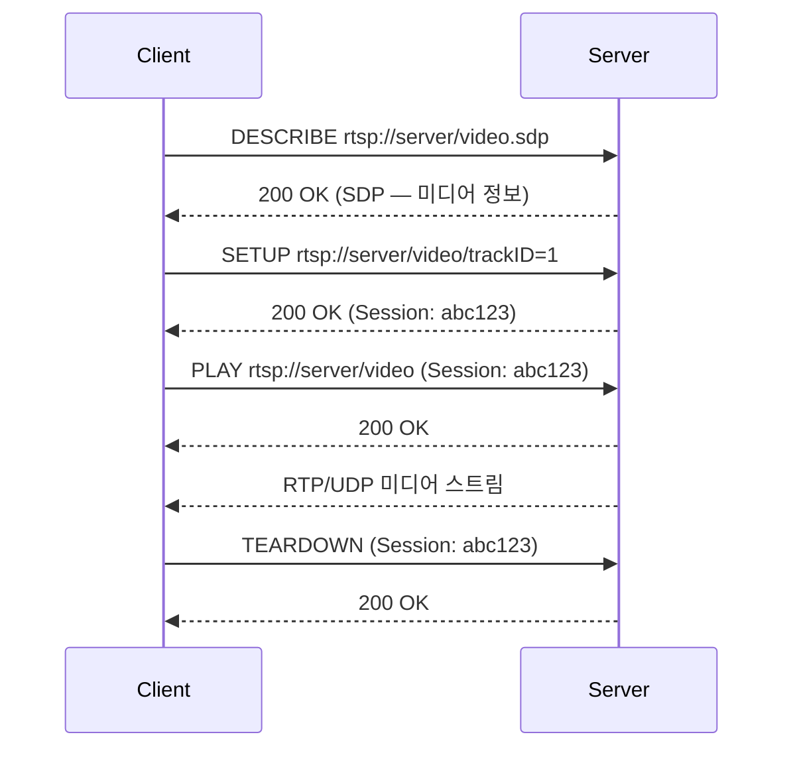
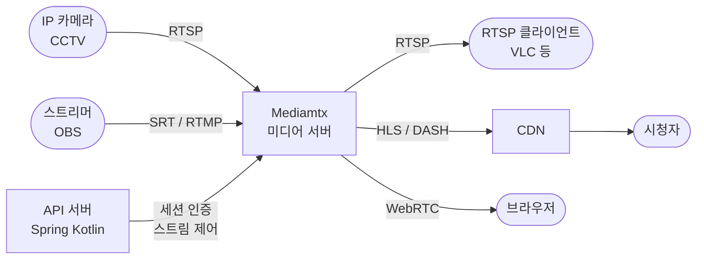

## 개요

1, 2편에서 다룬 프로토콜은 모두 TCP 위에서 동작했다. TCP는 패킷 손실 시 재전송을 보장하고 순서를 유지한다. 그런데 전화 통화나 CCTV처럼 실시간성이 중요한 상황에서는 이 보장이 오히려 문제가 된다.

이 글은 왜 실시간 미디어에 UDP를 쓰는지부터 시작해, 미디어 전송을 담당하는 RTP, 품질 피드백을 담당하는 RTCP, 재생을 제어하는 RTSP, 그리고 RTMP를 대체하는 SRT를 정리한다.

## TCP가 아닌 UDP를 쓰는 이유

TCP는 패킷이 손실되면 재전송을 요청하고, 그 패킷이 올 때까지 이후 패킷을 버퍼에 묶어둔다. 파일 전송이나 HTTP 요청에서는 이 동작이 당연히 맞다. 하지만 실시간 음성·영상에서는 다르다.

300ms 전에 손실된 음성 패킷이 지금 도착했다고 해서 재생할 수 있는 게 아니다. 이미 그 구간은 지나갔고, 늦게 도착한 패킷은 쓸모가 없다. 차라리 그 구간을 짧게 묵음 처리하거나 보간하는 편이 낫다.

TCP의 혼잡 제어도 문제다. 네트워크가 혼잡하면 TCP는 전송 속도를 갑자기 낮추는데, 이 순간 영상이 끊기거나 지연이 급격히 늘어난다.

UDP는 재전송도, 순서 보장도, 혼잡 제어도 없다. 그냥 보낸다. 손실된 패킷은 그냥 없는 것으로 처리한다. 실시간 미디어에서는 이 특성이 오히려 적합하다. RTP, RTCP, SRT는 모두 이 UDP 위에서 필요한 기능만 선택적으로 얹는 방식으로 동작한다.

## RTP (Real-time Transport Protocol)

RTP(RFC 3550)는 오디오·비디오 데이터를 실시간으로 전송하기 위한 프로토콜이다. UDP 위에서 동작하며, TCP가 제공하지 않는 타이밍 정보와 순서 정보를 헤더에 직접 담는다.

### 패킷 구조

RTP 헤더의 주요 필드는 다음과 같다.

```
 0                   1                   2                   3
 0 1 2 3 4 5 6 7 8 9 0 1 2 3 4 5 6 7 8 9 0 1 2 3 4 5 6 7 8 9 0 1
+-+-+-+-+-+-+-+-+-+-+-+-+-+-+-+-+-+-+-+-+-+-+-+-+-+-+-+-+-+-+-+-+
|V=2|P|X|  CC   |M|     PT      |       Sequence Number         |
+-+-+-+-+-+-+-+-+-+-+-+-+-+-+-+-+-+-+-+-+-+-+-+-+-+-+-+-+-+-+-+-+
|                           Timestamp                           |
+-+-+-+-+-+-+-+-+-+-+-+-+-+-+-+-+-+-+-+-+-+-+-+-+-+-+-+-+-+-+-+-+
|           Synchronization Source (SSRC) identifier           |
+-+-+-+-+-+-+-+-+-+-+-+-+-+-+-+-+-+-+-+-+-+-+-+-+-+-+-+-+-+-+-+-+
```

- **PT (Payload Type)**: 미디어 종류. 0=G.711 PCM, 96~127은 동적 할당 (H.264, AAC 등)
- **Sequence Number**: 패킷 순서 번호. 손실 감지에 사용
- **Timestamp**: 미디어 클럭 기반 재생 타이밍. 벽시계 시간이 아니라 샘플 단위
- **SSRC**: 송신자 식별자. 하나의 세션에서 여러 소스를 구분

### 시퀀스 번호와 타임스탬프

시퀀스 번호는 1씩 증가한다. 수신 측이 패킷을 받았을 때 번호가 연속적이지 않으면 손실이 발생했다는 것을 알 수 있다. 단, 손실된 패킷을 재요청하지는 않는다.

타임스탬프는 미디어 클럭을 기준으로 한다. 오디오가 8kHz라면 타임스탬프는 매 패킷마다 샘플 수만큼 증가한다. 이 값으로 수신 측은 각 패킷을 언제 재생해야 하는지 계산한다. 네트워크 지연(지터)이 발생해도 타임스탬프를 보고 정확한 타이밍에 재생할 수 있다.

## RTCP (RTP Control Protocol)

RTCP는 RTP의 짝꿍 프로토콜이다. 미디어 데이터는 RTP가 전송하고, RTCP는 그 전송 품질에 대한 피드백을 주고받는 역할을 한다.

### 역할 — 품질 피드백

RTCP 패킷은 주기적으로(일반적으로 세션 대역폭의 5% 이하) 전송된다. 수신 측이 송신 측에게 "패킷이 몇 개 손실됐고 지터가 얼마다"를 알려주면, 송신 측은 이를 바탕으로 전송 속도나 코덱 파라미터를 조절할 수 있다.

### SR / RR 패킷

RTCP의 핵심 패킷 두 가지다.

**SR (Sender Report)** — 송신자가 보낸다.
- 전송한 패킷 수, 바이트 수
- NTP 타임스탬프 (RTP 타임스탬프와 벽시계를 동기화하기 위해)

**RR (Receiver Report)** — 수신자가 보낸다.
- 패킷 손실율 및 누적 손실 수
- 최대 수신 시퀀스 번호
- 지터(interarrival jitter) — 패킷 도착 간격의 편차

이 외에 SDES(소스 설명), BYE(세션 종료) 패킷도 있다.

## RTSP (Real Time Streaming Protocol)

RTSP(RFC 2326)는 미디어 재생을 원격으로 제어하기 위한 프로토콜이다. 흔히 "네트워크 위의 VCR 리모컨"이라 불린다. 실제 미디어 데이터는 RTP/UDP로 전송하고, RTSP는 그 흐름을 제어하는 역할만 한다.

RTSP 자체는 TCP로 동작한다. 명령을 주고받는 채널은 신뢰성이 필요하기 때문이다.

### 동작 원리



### 주요 메서드

| 메서드 | 역할 |
|---|---|
| DESCRIBE | 스트림의 미디어 정보(SDP) 요청 |
| SETUP | 전송 방식(포트, 프로토콜) 협상 |
| PLAY | 재생 시작 |
| PAUSE | 일시 정지 |
| TEARDOWN | 세션 종료 |

IP 카메라, CCTV, IPTV, VLC 같은 미디어 플레이어가 RTSP를 주로 사용한다.

## SRT (Secure Reliable Transport)

### RTMP의 한계와 SRT의 등장

2편에서 RTMP가 라이브 스트리밍의 ingest 표준으로 쓰인다고 했다. 하지만 RTMP는 오래된 프로토콜이고 여러 한계가 있다.

- **TCP 기반**: 패킷 손실 시 HoL 블로킹으로 지연 급증
- **암호화 없음**: 전송 구간이 평문
- **방화벽**: 포트 1935가 차단된 환경이 많음
- **Flash 유산**: 더 이상 적극적으로 개발되지 않음

SRT는 Haivision이 2012년 개발하고 2017년 오픈소스로 공개한 프로토콜이다. UDP 위에서 동작하면서 RTMP의 단점을 보완한다.

### 동작 원리

SRT는 UDP를 쓰되, 손실된 패킷을 선택적으로 재전송(ARQ)하는 메커니즘을 갖는다. 단, 모든 패킷을 재전송하지 않는다. 설정된 지연 버퍼(latency buffer) 안에 도착할 수 있는 패킷만 재전송하고, 이미 재생 시점이 지난 패킷은 포기한다.

```
지연 버퍼 (예: 120ms)
┌──────────────────────────────────┐
│  손실 패킷 재전송 가능 구간       │  → 재전송 시도
└──────────────────────────────────┘
         ↑ 여기 넘으면 포기
```

AES-128/256 암호화가 기본 내장이며, 방화벽 환경을 위한 caller/listener/rendezvous 연결 모드도 지원한다.

### RTMP vs SRT

| | RTMP | SRT |
|---|---|---|
| 전송 계층 | TCP | UDP |
| 패킷 손실 처리 | TCP 재전송 (HoL 블로킹) | ARQ (지연 버퍼 내 선택적 재전송) |
| 암호화 | 없음 | AES-128/256 내장 |
| 지연 | 수 초 | 120~200ms (설정 가능) |
| 방화벽 | 포트 1935 | 유연한 포트 및 연결 모드 |
| 지원 현황 | 레거시, 광범위 | OBS, FFmpeg, 주요 플랫폼 점차 추가 |

## 구현 — 어떤 언어와 도구를 쓰는가

RTP/RTCP/RTSP/SRT는 패킷 단위의 저수준 처리가 필요하기 때문에 핵심 구현은 C/C++ 라이브러리에 집중되어 있다. 애플리케이션 코드는 이 라이브러리들을 래핑하거나 제어하는 역할을 한다.

| 레이어 | 도구 / 라이브러리 | 언어 |
|---|---|---|
| 프로토콜 구현 | FFmpeg, GStreamer, libsrt, Live555 | C / C++ |
| 미디어 서버 | Mediamtx (RTSP·RTMP·SRT·WebRTC 통합) | Go |
| WebRTC / RTP 스택 | Pion | Go |
| 화상회의 플랫폼 | Jitsi | Java |
| 오케스트레이션 / API | Spring, Node.js 등 | 무관 |

실무에서 Spring Kotlin으로 RTP를 직접 구현하는 경우는 드물다. FFmpeg 프로세스를 실행하거나, Mediamtx를 사이드카로 띄우고 API로 제어하는 방식이 일반적이다.

### Go 구현 예시 — Pion으로 RTP 수신

Pion은 Go로 작성된 WebRTC / RTP 라이브러리다. 아래는 UDP로 들어오는 RTP 패킷을 수신해 헤더 정보를 출력하는 예시다.

```go
package main

import (
    "fmt"
    "net"

    "github.com/pion/rtp"
)

func main() {
    conn, err := net.ListenUDP("udp", &net.UDPAddr{Port: 5004})
    if err != nil {
        panic(err)
    }
    defer conn.Close()

    buf := make([]byte, 1500)
    for {
        n, _, err := conn.ReadFrom(buf)
        if err != nil {
            break
        }

        packet := &rtp.Packet{}
        if err := packet.Unmarshal(buf[:n]); err != nil {
            continue
        }

        fmt.Printf("seq=%d  ts=%d  pt=%d  payload=%d bytes\n",
            packet.SequenceNumber,
            packet.Timestamp,
            packet.PayloadType,
            len(packet.Payload),
        )
    }
}
```

실제 서비스에서는 이 패킷을 디코딩하거나 다른 프로토콜로 재전송하는 파이프라인을 구성한다.

### 일반적인 구현 아키텍처

IP 카메라나 라이브 스트리머의 스트림을 받아 여러 클라이언트에게 배포하는 일반적인 구조다.



Mediamtx 하나가 RTSP·SRT·RTMP 수신과 HLS·WebRTC 배포를 모두 처리한다. API 서버는 스트림 인증이나 세션 관리 같은 비즈니스 로직을 담당하고, 미디어 처리 자체는 Mediamtx에 위임한다.

## 정리 — 어디에 쓰이는가

| 프로토콜 | 주요 사용 사례 |
|---|---|
| RTP | VoIP, 화상회의, IPTV (WebRTC도 내부적으로 사용) |
| RTCP | RTP와 항상 함께. 품질 모니터링, 적응형 전송률 조절 |
| RTSP | IP 카메라, CCTV, VLC 등 미디어 플레이어 |
| SRT | 라이브 스트리밍 ingest (RTMP 대체), 방송 기여 회선 |

RTP와 RTCP는 독립적으로 쓰이기보다 다른 프로토콜의 내부 구성 요소로 쓰이는 경우가 많다. 다음 편에서 다룰 WebRTC도 내부적으로 RTP/RTCP 위에서 미디어를 전송한다.
