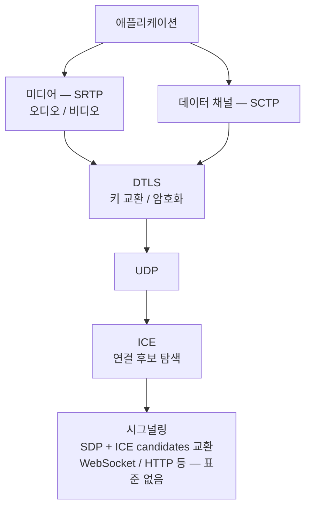
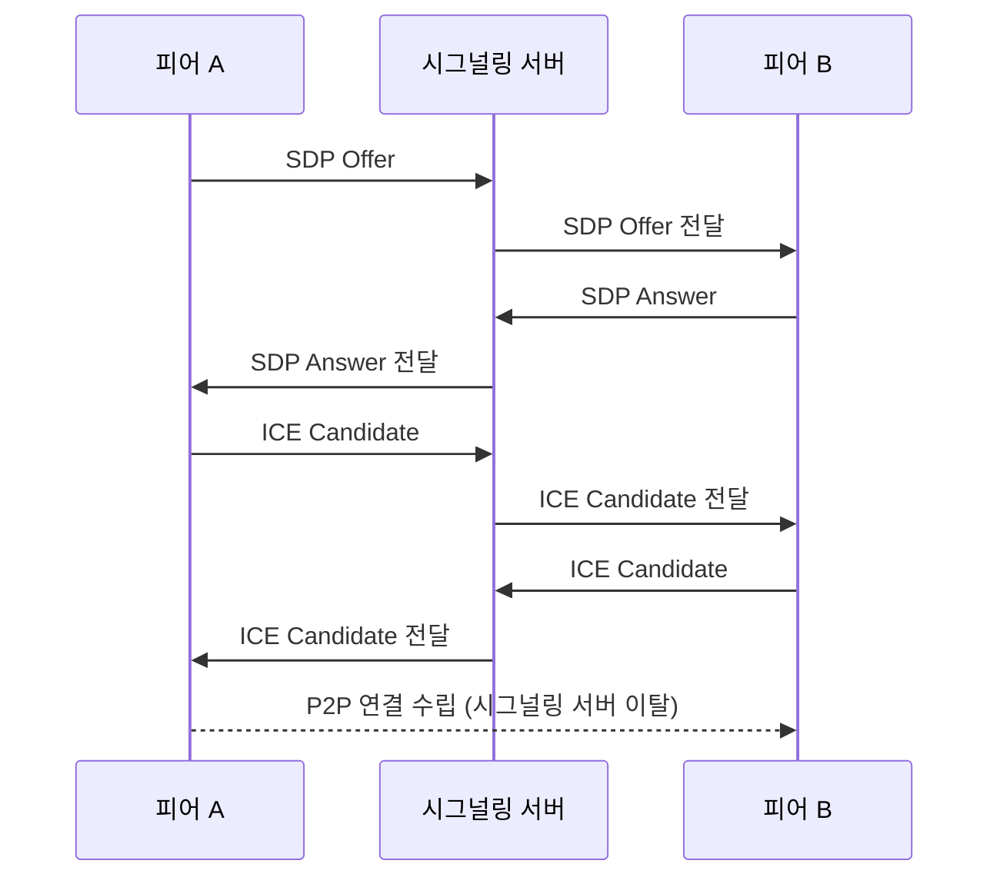
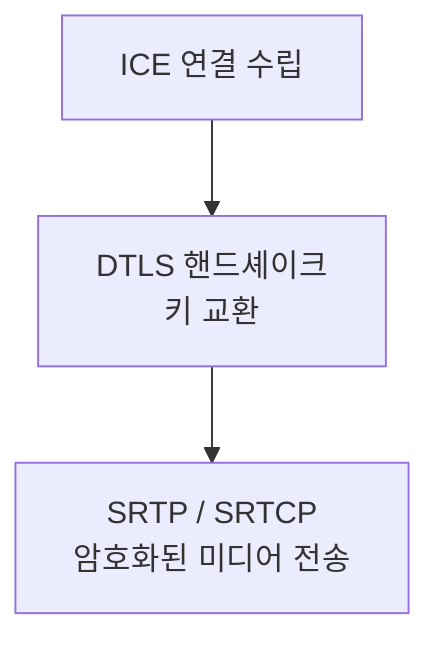
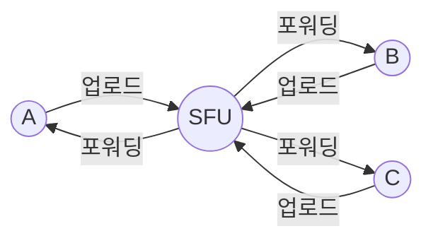

## 개요

지금까지 다룬 프로토콜은 모두 서버가 중심에 있었다. 클라이언트는 서버에 연결하고, 서버가 데이터를 전달했다. WebRTC는 다르다. 브라우저끼리 서버를 거치지 않고 직접 연결해 오디오, 영상, 데이터를 주고받는다.

Google Meet, Discord, Zoom의 화상 통화가 WebRTC 기반이다. 낮은 지연이 필요한 실시간 통신에서 서버 중계를 없애면 왕복 지연을 크게 줄일 수 있다.

다만 "서버가 없다"는 말은 완전히 정확하지 않다. 두 피어가 서로를 찾고 연결 정보를 교환하는 시그널링 단계에서는 서버가 필요하다. 미디어 데이터가 서버를 거치지 않을 뿐이다.

이 글은 WebRTC가 어떻게 두 브라우저를 직접 연결하는지, NAT 뒤에서 어떻게 연결을 뚫는지, 그리고 미디어를 어떻게 암호화해 전송하는지를 정리한다.

## WebRTC 스택 개요

WebRTC는 단일 프로토콜이 아니라 여러 프로토콜의 조합이다.



3편에서 다룬 RTP/RTCP가 WebRTC 내부에서도 쓰인다. SRTP는 DTLS로 교환한 키로 RTP 페이로드를 암호화한 것이다.

## 연결 수립 — 시그널링과 ICE

### 시그널링

WebRTC는 시그널링 프로토콜을 표준화하지 않았다. 두 피어가 연결 정보를 교환할 수 있으면 어떤 방식이든 상관없다. 실제로는 WebSocket이 가장 많이 쓰인다.

시그널링 단계에서 교환하는 것은 두 가지다.
- **SDP** (Session Description Protocol): 각자의 미디어 능력 기술
- **ICE candidates**: 연결 가능한 네트워크 후보 목록



### SDP (Session Description Protocol)

SDP는 "나는 이런 코덱을 지원하고, 이 포트로 받을 수 있다"는 정보를 텍스트로 기술한 파일이다.

```
v=0
o=- 12345 2 IN IP4 192.168.0.10
s=-
t=0 0
m=audio 49170 RTP/SAVPF 111
a=rtpmap:111 opus/48000/2
a=sendrecv
m=video 51372 RTP/SAVPF 96
a=rtpmap:96 VP8/90000
a=sendrecv
```

A가 Offer를 보내면 B는 자신이 지원하는 범위 안에서 Answer를 보낸다. 이 과정으로 사용할 코덱과 전송 파라미터가 협상된다.

### ICE — NAT를 넘는 방법

두 피어가 각자 NAT 뒤에 있으면 상대방의 사설 IP로는 직접 연결할 수 없다. ICE(Interactive Connectivity Establishment)는 연결 가능한 경로를 탐색하는 프레임워크다.

ICE는 세 종류의 후보를 수집한다.

- **Host candidate**: 장치의 로컬 IP (같은 네트워크에 있을 때 사용)
- **Server-reflexive candidate**: STUN 서버가 알려준 공인 IP/포트
- **Relayed candidate**: TURN 서버를 통한 중계 주소

수집한 후보들을 시그널링으로 상대방과 교환한 뒤, 우선순위 순으로 연결 시도를 한다. 성공한 경로로 최종 연결이 수립된다.

### STUN

STUN(Session Traversal Utilities for NAT)은 피어가 자신의 공인 IP와 포트를 알아내기 위해 사용한다. 공개 STUN 서버(Google의 `stun.l.google.com:19302` 등)에 UDP 패킷을 보내면, 서버가 수신한 출발지 IP/포트를 응답으로 돌려준다.

대부분의 연결(약 80%)은 STUN만으로 성공한다.

### TURN

TURN(Traversal Using Relays around NAT)은 직접 연결이 불가능할 때 중계 서버를 통해 우회하는 방법이다. 대칭 NAT 환경처럼 STUN으로도 연결이 안 될 때 사용한다.

TURN 서버가 두 피어 사이에서 패킷을 중계하기 때문에 서버 대역폭이 소모된다. 전체 WebRTC 연결의 약 15~20%가 TURN을 거친다. 신뢰성 있는 서비스를 위해 자체 TURN 서버를 운영하거나 Twilio, Xirsys 같은 서비스를 사용한다.

## 미디어 전송 — DTLS + SRTP

연결이 수립되면 미디어는 SRTP(Secure RTP)로 전송된다. SRTP는 3편에서 다룬 RTP에 암호화를 추가한 것이다.

암호화 키는 DTLS(Datagram TLS) 핸드셰이크로 교환한다. DTLS는 TLS를 UDP에서 동작하도록 수정한 프로토콜이다. WebRTC 명세상 모든 미디어는 반드시 암호화되어야 한다.



RTCP도 SRTCP로 암호화되어 동일 경로로 전송된다.

## 데이터 채널 — SCTP

WebRTC는 미디어 외에도 임의의 데이터를 주고받을 수 있는 데이터 채널을 제공한다. 파일 전송, 게임 상태 동기화, 채팅 등에 쓰인다.

데이터 채널은 SCTP(Stream Control Transmission Protocol)를 DTLS 위에서 사용한다. SCTP는 채널별로 순서 보장 여부와 신뢰성 여부를 독립적으로 설정할 수 있다.

```javascript
const channel = pc.createDataChannel('chat', {
    ordered: true,      // 순서 보장
    reliable: true      // 재전송 보장
})

channel.onmessage = (e) => console.log(e.data)
channel.send('hello')
```

## P2P vs 서버 중계 — SFU / MCU

1:1 통화에서는 P2P가 최적이다. 하지만 참여자가 늘어나면 문제가 생긴다. N명이 P2P로 연결하면 각자 N-1개의 연결을 유지해야 하고, 업로드 스트림도 N-1개 필요하다. 5명만 넘어도 클라이언트 부담이 급격히 커진다.

이를 해결하기 위해 서버 중계 방식을 사용한다.

**SFU (Selective Forwarding Unit)**: 각 피어는 서버에 하나의 스트림만 업로드한다. SFU가 수신한 스트림을 다른 참여자에게 그대로 포워딩한다. 서버가 디코딩/인코딩을 하지 않아 CPU 부담이 낮다. Google Meet, Discord가 이 방식이다.

**MCU (Multipoint Control Unit)**: SFU가 모든 스트림을 하나로 합성(믹싱)해서 각 참여자에게 단일 스트림으로 보낸다. 클라이언트 수신 부담은 줄지만 서버 CPU 사용이 매우 높다. 레거시 화상회의 시스템에서 쓰였다.



## 구현 예시

### 브라우저 (JavaScript)

브라우저에서 `RTCPeerConnection` API로 Offer/Answer를 교환하고 미디어를 전송한다.

```javascript
const pc = new RTCPeerConnection({
    iceServers: [
        { urls: 'stun:stun.l.google.com:19302' },
        { urls: 'turn:turn.example.com', username: 'user', credential: 'pass' }
    ]
})

// 카메라/마이크 스트림 추가
const stream = await navigator.mediaDevices.getUserMedia({ video: true, audio: true })
stream.getTracks().forEach(track => pc.addTrack(track, stream))

// ICE candidate 수집되면 시그널링으로 전송
pc.onicecandidate = (e) => {
    if (e.candidate) signalingChannel.send({ candidate: e.candidate })
}

// 상대방 스트림 수신
pc.ontrack = (e) => {
    document.getElementById('remote-video').srcObject = e.streams[0]
}

// Offer 생성 및 시그널링
const offer = await pc.createOffer()
await pc.setLocalDescription(offer)
signalingChannel.send({ sdp: offer })
```

### Go — Pion

Pion은 Go로 작성된 WebRTC 구현체다. 서버 측에서 브라우저와 WebRTC로 연결할 때 많이 쓰인다.

```go
package main

import (
    "fmt"
    "github.com/pion/webrtc/v3"
)

func main() {
    pc, err := webrtc.NewPeerConnection(webrtc.Configuration{
        ICEServers: []webrtc.ICEServer{
            {URLs: []string{"stun:stun.l.google.com:19302"}},
        },
    })
    if err != nil {
        panic(err)
    }
    defer pc.Close()

    // 원격 트랙 수신 핸들러
    pc.OnTrack(func(track *webrtc.TrackRemote, _ *webrtc.RTPReceiver) {
        fmt.Printf("수신 트랙: %s\n", track.Kind())
        for {
            pkt, _, err := track.ReadRTP()
            if err != nil {
                return
            }
            fmt.Printf("seq=%d ts=%d payload=%d bytes\n",
                pkt.SequenceNumber, pkt.Timestamp, len(pkt.Payload))
        }
    })

    // ICE 연결 상태 변화
    pc.OnICEConnectionStateChange(func(state webrtc.ICEConnectionState) {
        fmt.Printf("ICE 상태: %s\n", state)
    })

    // 시그널링으로 받은 Offer를 설정하고 Answer 생성
    // offer := ... (시그널링으로 수신)
    // pc.SetRemoteDescription(offer)
    // answer, _ := pc.CreateAnswer(nil)
    // pc.SetLocalDescription(answer)
}
```

## BitTorrent 계열 P2P와의 차이

둘 다 P2P지만 목적과 설계가 완전히 다르다.

| | WebRTC | BitTorrent |
|---|---|---|
| 목적 | 실시간 미디어 / 데이터 | 파일 공유 |
| 전송 | UDP (SRTP, SCTP) | TCP / UDP (uTP) |
| 피어 탐색 | 시그널링 서버 필요 | DHT, 트래커 |
| NAT 통과 | ICE / STUN / TURN | 제한적 |
| 지연 요구 | 매우 낮음 (실시간) | 낮음 불필요 |
| 브라우저 지원 | 네이티브 | WebTorrent (WebRTC 기반) |

BitTorrent는 파일을 청크로 나눠 여러 피어에서 동시에 내려받는 방식이라 실시간성보다 처리량이 중요하다. 흥미로운 점은 WebTorrent가 브라우저에서 BitTorrent를 구현하기 위해 WebRTC 데이터 채널을 전송 계층으로 사용한다는 것이다.
