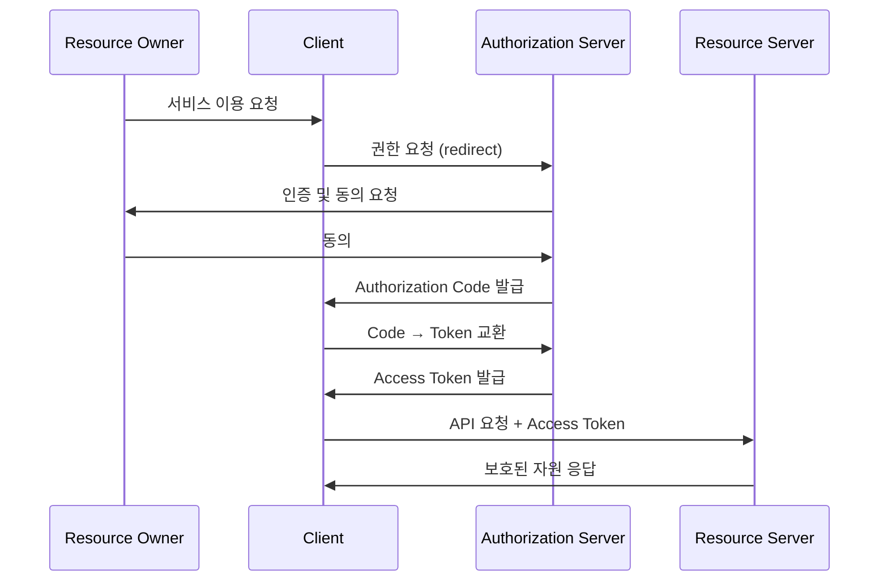
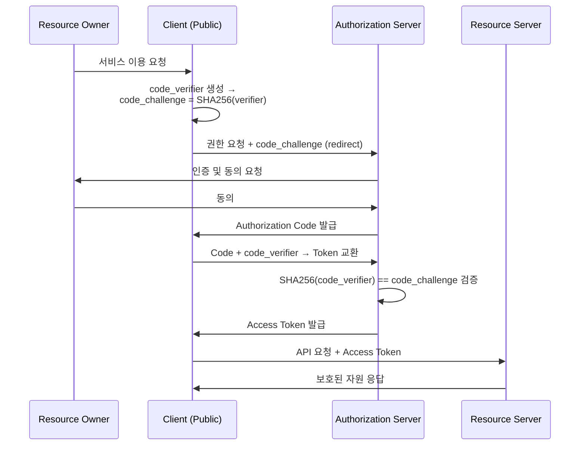
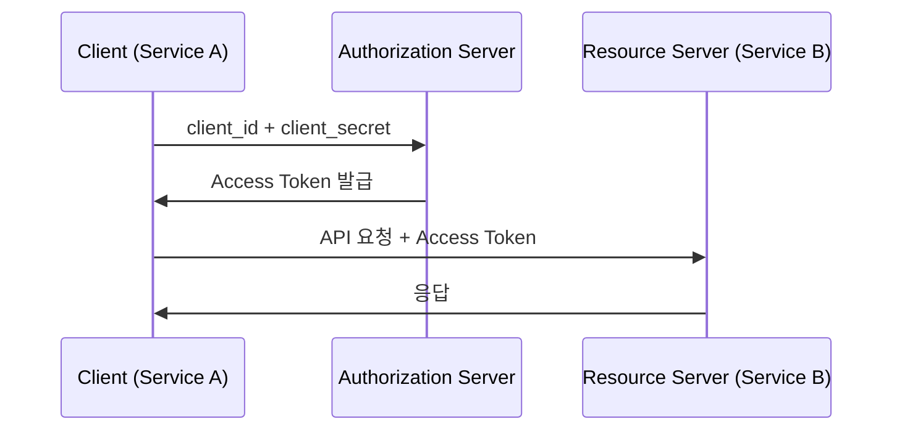

## 개요

왜 OAuth2여야만 하는가. 오늘날 수많은 웹 서비스는 서로의 자원에 접근을 요청하고 허락하는 일을 끊임없이 반복한다. 인증과 인가로 풀이할 수 있는 이러한 요청과 허가들은 자연스레 구체적인 신뢰 체계 표준에 대한 수요를 이끌었다. 그 결과 신뢰의 위임을 핵심으로 한 OAuth2는 2.1과 수많은 확장 스펙을 거치며 인증/인가 체계의 사실상 표준으로 자리를 굳혔다. 그렇다면 OAuth2는 왜 오늘날의 표준으로 자리잡을 수 있었던 것일까?

이 글에서는 OAuth2가 왜 필요했는지를 인증/인가 표준의 변천사에서 짚어본다. 흐름에 참여하는 엔티티들이 어떤 역할을 하는지, 흐름 안에서 어떤 데이터가 발생하고 어디로 흘러가는지, Grant Types는 각각 어떤 문제를 해결하는지 살펴본다. 마지막으로 OAuth2 위에 인증을 얹은 OIDC까지 다룬다.

## 인증과 인가 표준의 변천사

### Pre OAuth2.0: OIDC 와 OAuth1.0 의 등장

초기 웹 인증은 단순했다. HTTP Basic Auth는 username과 password를 요청 헤더에 담아 보내는 방식이었고, Kerberos는 기업 내부망에서 신뢰할 수 있는 티켓 서버를 중심으로 동작했다. 각자의 영역 안에서는 잘 작동했다.

문제는 영역이 넓어지면서 생겼다. 기업들이 서로 다른 시스템을 연결하고, 파트너사의 직원이 우리 서비스에 접근해야 하는 상황이 생겼다. 이를 풀기 위해 등장한 것이 SAML이다. XML 기반의 SAML은 기업 간 SSO를 표준화했고, 지금도 엔터프라이즈 환경에서 건재하다.

그런데 웹이 더 넓어지자, SAML이 전제한 "기업 IdP 중심의 구조"가 발목을 잡기 시작했다. 누구나 쓸 수 있는 인터넷 서비스 환경에서 두 가지 질문이 새롭게 떠올랐다. 하나는 신원 — "이 사람이 누구인가를 각 서비스마다 비밀번호 없이 증명할 수 있는가." 다른 하나는 위임 — "이 앱이 내 비밀번호 없이 내 구글 캘린더에 접근할 수 있는가."

첫 번째 질문에 답하려 한 것이 OpenID다. 사용자는 하나의 URL(예: `user.myopenid.com`)로 여러 서비스에 로그인할 수 있었다. 분산 신원의 시도였고, 나중에 OIDC가 이 개념을 OAuth2 위에서 훨씬 단순하게 재구현한다.

두 번째 질문에 답하려 한 것이 OAuth 1.0이다. 비밀번호를 직접 넘기지 않고 권한을 위임하는 최초의 표준화된 시도였다. 방향은 옳았다. 하지만 모든 요청에 HMAC-SHA1 서명, nonce, 타임스탬프를 붙여야 했다. 구현 복잡도가 높았고, 특히 모바일 환경에서 다루기 어려웠다.

| 프로토콜 | 연도 | 특징 |
|---|---|---|
| HTTP Basic / Digest Auth | 1990s | username:password를 직접 전달. 가장 단순한 방식 |
| Kerberos | 1988 | 티켓 기반. Windows AD, 기업 내부망 환경 |
| SAML 1.0 / 2.0 | 2002 / 2005 | XML 기반 SSO. 기업 환경에서 여전히 쓰임 |
| OpenID 1.0 / 2.0 | 2005 / 2007 | 분산 신원 인증. OIDC의 전신, 현재는 거의 사용 안 함 |
| OAuth 1.0 / 1.0a | 2007 / 2009 | 서명 기반 위임 인가. 구현 복잡도로 인해 OAuth2로 대체 |

### OAuth2.0: The OAuth 2.0 Authorization Framework

2000년대 후반, 스마트폰이 보급되고 SPA가 등장하면서 제3자 앱이 사용자 대신 API를 호출하는 패턴이 폭발적으로 늘었다. Twitter, Google, Facebook이 API를 열었고, 수많은 앱이 그 위에 올라탔다. OAuth 1.0a로는 감당이 어려웠다.

근본적인 문제가 있었다. 제3자 앱에 권한을 주려면 결국 사용자의 비밀번호를 앱에 넘겨야 했다. 넘기는 순간 앱은 계정에 대한 전권을 갖게 되고, 사용자는 그 권한을 선택적으로 철회할 방법이 없었다.

OAuth2(RFC 6749: The OAuth 2.0 Authorization Framework, 2012)는 이를 "위임"으로 풀었다. 비밀번호 대신 특정 scope의 권한만 담은 토큰을 발급한다. 서명 대신 HTTPS 위의 Bearer Token으로 단순화했다. 상황에 맞는 여러 Grant Type을 정의해 서버 사이드, SPA, 모바일, 서버 간 통신을 모두 아울렀다. 구현이 쉬워졌고 표준이 자리잡는 데 오랜 시간이 걸리지 않았다.

### Post OAuth2.0: 추가내용

OAuth2.0 까지의 흐름을 보는 것만으로도 충분하겠지만 OAuth2 이후의 흐름을 간략하게나마 소개한다. 요약하자면 세 방향에서 움직임이 일었다.

첫째, OAuth2가 의도적으로 답하지 않은 질문을 채웠다. OAuth2는 인가(authorization) 프레임워크다. "이 앱이 내 자원에 접근해도 되는가"는 답하지만, "이 사람이 누구인가"는 답하지 않는다. OIDC가 이 공백을 채웠고, 우리가 흔히 "소셜 로그인"이라 부르는 것의 실체가 됐다. PKCE는 Authorization Code 탈취 공격에 무방비였던 Public Client 환경을 보완했다.

둘째, 비밀번호 자체를 없애는 방향으로 나아갔다. FIDO2와 WebAuthn은 생체인식과 하드웨어 키를 인증 수단으로 표준화했다. Passkeys는 Apple, Google, Microsoft가 연합해 이 경험을 플랫폼 수준으로 통합한 결과물이다. OAuth2 위에서 동작하는 것이 아니라, 인증 방식 자체를 바꾸는 흐름이다.

셋째, OAuth2의 한계를 보완하거나 대체하려는 시도가 이어졌다. DPoP은 Bearer Token의 구조적 취약점(탈취된 토큰의 재사용)을 키 바인딩으로 막는다. GNAP은 OAuth2가 설계 당시 고려하지 못한 제약들을 근본부터 다시 풀어내려는 시도로, 업계에서는 "OAuth3"라고도 부른다.

| 프로토콜 / 표준 | 연도 | 특징 |
|---|---|---|
| OIDC | 2014 | OAuth2 위에 인증 레이어 추가 |
| PKCE | 2015 | Public Client 보안 확장 |
| FIDO2 / WebAuthn | 2018 | 비밀번호 없는 인증. 생체인식, 하드웨어 키 |
| Passkeys | 2022~ | FIDO2 기반. Apple / Google / MS 공동 추진 |
| DPoP | 2023 | 토큰을 키 쌍에 바인딩. 탈취 시 재사용 방지 |
| OAuth 2.1 | 초안 | OAuth2 모범 사례 통합. Implicit, ROPC 공식 제거 |
| GNAP | 진행 중 | "OAuth3"로 불림. OAuth2의 한계 해결 시도 |

#### OAuth 2.1: OAuth 는 현재 진행형

OAuth2가 자리잡으면서 하나의 문제가 생겼다. RFC 6749 본문과 수십 개의 확장 RFC, 그리고 Best Current Practice 문서들이 여기저기 흩어졌다. Implicit Grant와 Resource Owner Password Credentials(ROPC)는 보안상 사용을 권장하지 않는다는 것이 업계의 합의였지만, 명세에는 여전히 남아있었다. PKCE는 별도 RFC였고, 개발자마다 적용 여부가 달랐다.

OAuth 2.1은 이 상황을 정리하는 작업이다. 새로운 기능을 추가하는 것이 아니라, 10년간 쌓인 모범 사례를 하나의 문서로 통합한다. Implicit과 ROPC를 공식 제거하고, Authorization Code + PKCE를 기본으로 명시하며, Refresh Token Rotation을 권장 사항으로 포함한다.

아직 초안 상태지만, 현업에서는 이미 이 방향으로 수렴하고 있다. OAuth 2.1을 구현한다는 것은 새로운 스펙을 도입하는 것이 아니라, 현재의 OAuth2 모범 사례를 따르는 것과 사실상 같다.

## OAuth2의 구조

앞선 변천사에서 우리는 OAuth2 가 다음과 같은 이유로 등장했음을 확인했다.

- 제3자 앱에 권한을 주려면 비밀번호를 직접 넘겨야 했다. 한 번 넘기면 범위를 제한하거나 철회할 방법이 없었다
- OAuth 1.0은 방향은 옳았지만 서명 기반의 구현 복잡도가 너무 높았다
- 서버 사이드, SPA, 모바일, 서버 간 통신을 아우르는 하나의 위임 표준이 없었다

OAuth2는 이 문제들을 구체적으로 어떻게 풀었는가. 그 구조를 살펴본다.

### 프레임워크 참여 엔티티들

RFC 6749는 이들을 "Role"이라고 부른다. 다시말해 명세는 기능적 정의에 집중하지만, 이 글에서는 직관적인 설명을 위해 그 기능을 수행하는 실체란 의미에서 "엔티티" 란 표현을 사용하겠다.

**Resource Owner (이하 RO)** — 자원에 대한 접근 권한을 부여할 수 있는 엔티티다. 소셜 로그인에서는 사용자 본인이 Resource Owner다. 서버 간 통신(M2M)에서는 사람이 아니라 시스템 자체가 주체가 된다.

**Client** — 자원에 접근하려는 애플리케이션이다. 두 가지 유형으로 나뉜다.
- **Confidential Client**: 서버 사이드 앱. `client_secret`을 안전하게 보관할 수 있다.
- **Public Client**: SPA, 모바일 앱. 코드가 사용자 환경에 노출되기 때문에 `client_secret`을 가질 수 없다. 이 경우 PKCE가 필수다.

**Authorization Server (이하 AS)** — Resource Owner의 동의를 받고 토큰을 발급하는 서버다. Google, Kakao, GitHub의 로그인 서버가 여기에 해당한다. 신뢰의 원천이다.

**Resource Server (이하 RS)** — 보호된 자원을 보유한 서버다. Client가 Access Token을 제시하면 토큰을 검증한 뒤 자원을 응답한다. Google People API, GitHub API 등이 여기에 해당한다.

### 흐름 개요

OAuth2 흐름의 핵심은 단순하다. 사용자가 앱에게 "내 자원에 접근해도 좋다"는 동의를 주면, Authorization Server가 그 동의를 증명하는 토큰을 발급한다. 앱은 그 토큰으로 자원에 접근한다. 비밀번호는 어디에도 등장하지 않는다.

> 다이어그램 상 표현된 바는 없지만, Client가 AS에 권한을 요청할 때 `calendar.read`, `profile` 와 같이 scope 를 함께 명시한다. — Resource Owner가 동의 화면에서 이 범위를 확인하고 수락한다. Access Token은 그 scope 안에서만 유효하다.

흐름을 보면 몇 가지 의문이 생긴다. Authorization Server가 바로 Access Token을 주면 되는데, 왜 Authorization Code라는 단계가 있는가. Access Token이 탈취되면 어떻게 되는가. Refresh Token은 왜 따로 존재하는가. Resource Server는 Access Token을 어떻게 신뢰하는가.

### 신뢰를 위임할 수 있는 이유: 신뢰의 증표

OAuth2 흐름에서 엔티티 사이를 오가는 데이터들은 모두 **신뢰의 증표**다. AS가 신뢰의 원천이고, 발급하거나 보증한 것들이 흐름을 따라 이동한다. 각 증표는 수명과 노출 시 피해 범위가 다르게 설계되어 있다.

| 증표 | 수명 | 노출 시 피해 범위 |
|---|---|---|
| AS 서명 키 (private key) | 수개월 | 모든 토큰 위조 가능 |
| `client_secret` | 영구 | 해당 앱의 모든 사용자 |
| Refresh Token | 수일 ~ 수주 | 장기 접근 탈취 |
| Access Token | 1시간 이하 | 해당 토큰 scope 범위 |
| Authorization Code | 10분, 1회용 | 즉시 토큰 교환 가능 |

> `client_secret`의 수명을 "영구"로 표기했지만, 갱신하면 안 된다는 의미가 아니다
> 
> RFC 7592(OAuth 2.0 Dynamic Client Registration Management)는 `client_secret` rotation 엔드포인트를 정의하고 있으며, 주요 provider들이 이를 지원한다.

수명이 짧을수록 노출 피해가 작고, 수명이 길수록 저장 전략이 중요해진다. 각 증표가 왜 이런 형태로 설계되어 있는지 살펴본다.

#### Authorization Code: 왜 토큰을 바로 주지 않는가

Authorization Server가 Access Token을 redirect URL에 직접 담아 보내면 어떻게 될까. URL은 브라우저 히스토리에 남고, 서버 접근 로그에 기록되며, Referer 헤더를 통해 새어나갈 수 있다. 브라우저를 통과하는 경로 자체가 안전하지 않다.

Authorization Code는 수명 10분, 1회용이다. Code를 Access Token으로 교환하는 요청은 브라우저가 아닌 서버에서 직접 AS로 전달된다. 이 요청에는 `client_secret`이 필요하다 — 공격자가 Code를 탈취하더라도 `client_secret` 없이는 토큰으로 교환할 수 없다.

#### Access Token과 Refresh Token: 수명의 설계

Bearer Token은 가진 자가 곧 사용할 수 있다. 탈취되면 수명이 다할 때까지 악용될 수 있다. 이 피해 범위를 줄이기 위해 Access Token의 수명은 짧게 설계한다 — 보통 1시간 이하.

Refresh Token이 그 간극을 채운다. Access Token이 만료될 때 새 Access Token을 발급받는 데 쓰인다. 브라우저 redirect 없이 서버와 AS 사이에서만 오간다. 수명은 길지만, 그만큼 노출 시 피해가 크기 때문에 안전한 저장소에 보관해야 한다.

#### Client는 어떻게 자신을 증명하는가

Confidential Client는 `client_id`와 `client_secret`으로 자신을 증명한다. 서버 사이드에서 실행되기 때문에 secret을 안전하게 보관할 수 있다.

Public Client는 다르다. SPA나 모바일 앱의 코드는 사용자 환경에 노출되기 때문에 `client_secret`을 가질 수 없다. 이 경우 PKCE(Proof Key for Code Exchange)가 대신한다. 요청 시 임의의 `code_verifier`를 생성하고 그 해시값인 `code_challenge`를 AS에 보낸다. 나중에 Code를 교환할 때 원본 `code_verifier`를 제출하면 AS가 검증한다 — secret 없이도 같은 Client임을 증명한다.

#### Resource Server는 어떻게 토큰을 신뢰하는가

Access Token의 형식에 따라 두 가지 방식으로 나뉜다.

**JWT**: 토큰 안에 클레임(issuer, expiry, scope 등)이 담겨 있고 AS의 private key로 서명되어 있다. RS는 AS의 public key(JWKS 엔드포인트에서 가져옴)로 서명을 검증한다. AS에 별도로 묻지 않고 자체적으로 신뢰를 확인할 수 있다.

**Opaque Token**: 토큰이 랜덤 문자열이라 RS가 내용을 알 수 없다. RS는 AS의 Introspection 엔드포인트(RFC 7662)에 유효성을 묻는다. AS가 유효 여부와 scope를 응답한다.

두 방식 모두 결국 AS가 신뢰의 원천이다. JWT는 서명으로 오프라인 검증하고, Opaque는 매번 AS에 확인하는 차이다.

### Grant Types: 상황에 따른 인가 방식

앞서 살펴본 흐름 다이어그램과 설명은 Grant Types 중에서도 Authorization Code 타입의 흐름을 그려낸 흐름이자 설명이다. OAuth2는 상황에 따라서 다른 Grant Type을 정의하고 있다.

| Grant Type | 용도 | 비고 |
|---|---|---|
| Authorization Code | 서버 사이드 앱, 소셜 로그인 | 현재 권장 방식 |
| Authorization Code + PKCE | SPA, 모바일 | Public Client 필수 |
| Client Credentials | 서버 간 통신 (M2M) | 사용자 없음 |
| Implicit | (구) SPA | Deprecated |
| Resource Owner Password | (구) 직접 자격증명 | Deprecated |

#### Authorization Code + PKCE

**Authorization Code (+ PKCE)** 는 사용자가 직접 동의하는 모든 흐름에서 쓰인다. Confidential Client라면 `client_secret`으로, Public Client라면 PKCE로 Code 교환 시 신원을 증명한다. OAuth 2.1에서는 이 방식이 사실상 유일한 권장 Grant Type이다.

#### Client Credentials

**Client Credentials** 는 Resource Owner가 사람이 아닌 경우다. 서비스 A가 서비스 B의 API를 호출하는 M2M 시나리오에서 쓰인다. 사용자 동의 화면이 없고, Client가 `client_id`와 `client_secret`으로 AS에서 직접 Access Token을 발급받는다.

#### Implicit / ROPC (Deprecated)

**Implicit** 은 Authorization Code 교환 없이 redirect URL에 Access Token을 직접 담아 돌려주는 방식이었다. SPA 환경에서 Code 교환 단계를 줄이려는 의도였지만, Access Token이 브라우저를 통과한다는 점에서 앞서 살펴본 URL 노출 문제가 그대로 남는다. PKCE의 등장으로 Public Client에서도 Authorization Code를 안전하게 쓸 수 있게 되면서 폐기됐다.

**Resource Owner Password Credentials(ROPC)** 는 Client가 사용자의 username과 password를 직접 받아 AS에 넘기는 방식이다. 비밀번호를 제3자 앱이 취급한다는 점에서 OAuth2의 핵심 전제 — "비밀번호를 앱에 넘기지 않는다" — 를 정면으로 어긴다. 레거시 시스템 마이그레이션 용도로만 허용됐었고, OAuth 2.1에서 공식 제거됐다.

## OIDC: 인증을 얹다

OAuth2 흐름이 끝나면 Access Token을 손에 쥔다. 이 토큰으로 RS의 API를 호출할 수 있다. 그런데 한 가지를 알 수 없다. 지금 로그인한 사람이 누구인가.

Access Token은 권한의 증표다. "이 앱이 이 scope 안에서 이 자원에 접근해도 된다"는 것을 증명하지만, "이 사람이 누구인가"는 담겨 있지 않다. OAuth2가 의도적으로 범위를 인가(authorization)로 한정했기 때문이다.

OIDC(OpenID Connect)는 이 공백을 채운다. OAuth2 흐름을 그대로 쓰되, scope에 `openid`를 추가하는 것만으로 AS가 Access Token과 함께 **ID Token**을 발급한다.

ID Token은 JWT다. 안에는 사용자 신원 클레임이 담겨 있다.

| 클레임 | 의미 |
|---|---|
| `sub` | 사용자 고유 식별자 (Subject) |
| `iss` | 발급자 (Issuer) — AS의 URL |
| `aud` | 수신자 (Audience) — Client의 `client_id` |
| `exp` | 만료 시각 |
| `email`, `name` | `email`, `profile` scope 추가 요청 시 포함 |

Client는 ID Token을 decode하여 서명을 검증하고, `sub`로 사용자를 식별한다. AS에 별도로 묻지 않아도 된다. 추가 정보가 필요하다면 UserInfo 엔드포인트를 Access Token으로 조회할 수 있지만, 대부분의 경우 ID Token만으로 충분하다.

### 흔한 오해와 실수: 소셜 로그인의 실체

"Google로 로그인" 버튼을 클릭하는 순간 실제로 일어나는 일은 이렇다. scope에 `openid email profile`이 담긴 Authorization Code 흐름이 시작되고, 동의를 마치면 Google AS가 Access Token과 ID Token을 함께 발급한다. 서비스는 ID Token에서 `sub`와 `email`을 꺼내 사용자를 식별하고 세션을 만든다.

"소셜 로그인 = OAuth2"라고 알고 있는 경우가 많지만, 정확히는 OIDC다. OAuth2만으로는 "이 사람이 누구인가"를 알 수 없다.

### 흔한 오해와 실수: ID Token으로 API를 호출한다

Access Token과 ID Token이 둘 다 JWT 형식인 경우, 구분 없이 쓰는 실수가 생긴다. 실제로 두 토큰의 `aud`(audience) 클레임이 다르다. ID Token의 `aud`는 Client — "이 신원 정보는 이 앱을 위한 것"이라는 의미다. Access Token의 `aud`는 RS — "이 권한은 이 API를 위한 것"이다.

ID Token을 들고 RS의 API를 호출하면, RS가 `aud`를 검증하는 순간 거부된다. 거부하지 않는다면 RS가 검증을 제대로 하지 않는 것이다.

한편 ID Token은 "로그인 이벤트의 증표"다. 따라서 Client는 로그인 시점에 `sub`와 필요한 클레임을 꺼내 자체 세션이나 DB에 기록하고, 그 이후로는 ID Token을 버리는 것이 타당하다. 보관하거나 갱신하는 것이 아니므로, ID Token 을 Access Token 처럼 활용하는 것은 명백한 오용이다.

### 흔한 오해: decode하면 검증된 것이다

`jwt.decode()`는 서명을 검증하지 않는다. Base64로 인코딩된 payload를 읽을 수 있는 형태로 바꾸는 것뿐이다. 누구든 토큰을 decode할 수 있고, 위조된 토큰도 decode는 된다.

실제 검증은 AS의 public key(JWKS 엔드포인트에서 가져옴)로 서명을 확인하는 것이다. 서명이 유효하지 않으면 토큰을 신뢰해선 안 된다.

## 마치며

부끄럽지만 2-3년 전의 필자는 "왜 OAuth2여야만 하는가"라는 다소 투정 섞인 질문으로 공부를 시작한 적이 있다. 기술의 트렌드만 쫓던, 뒤처짐이 무서워 조급하기만 했던 시절이었다. 이 글은 그 기억을 되새기고자 쓴 글이기도 하고, 비슷한 마음을 느꼈던 사람들을 위한 글이기도 하다.

그 투정이 그릇된 것이라 생각하지 않는다. 변천사를 짚어보며 왜 이 구조가 필요했는지, 어떤 고민들이 녹아들었는지를 들여다보고 나면 — 수많은 사람들이 함께 빚은 그 구조가 얼마나 아름다운지 비로소 느낄 수 있게 되기 때문이다.

왜 OAuth2여야만 하는가라는 당시의 투정은 필자에게 이제야 다시 돌아와 OAuth2 는 더 아름다워질 수 있는가란 질문으로 바뀐다. Passkeys, DPoP, GNAP — 그 질문에 답하려는 시도들이 지금도 이어지고 있다. 앞으로의 신뢰 체계가 어떤 모습으로 빚어질지, 기대된다.
