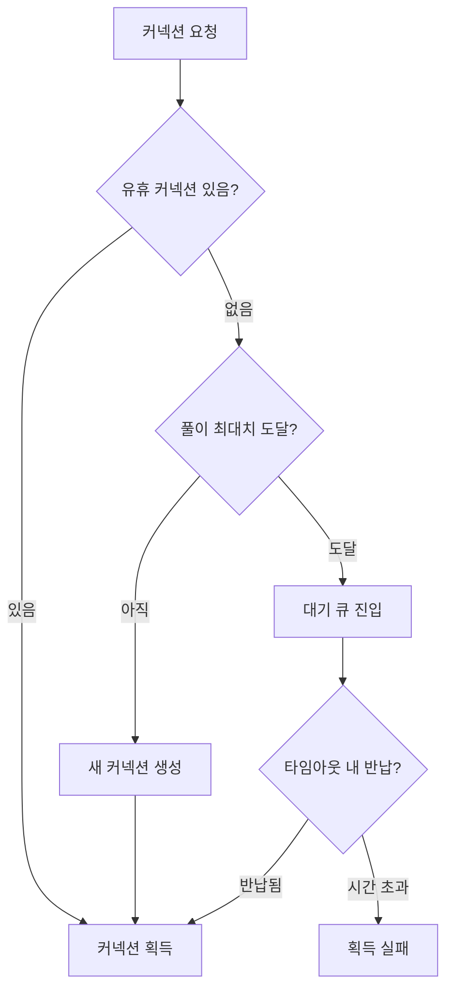
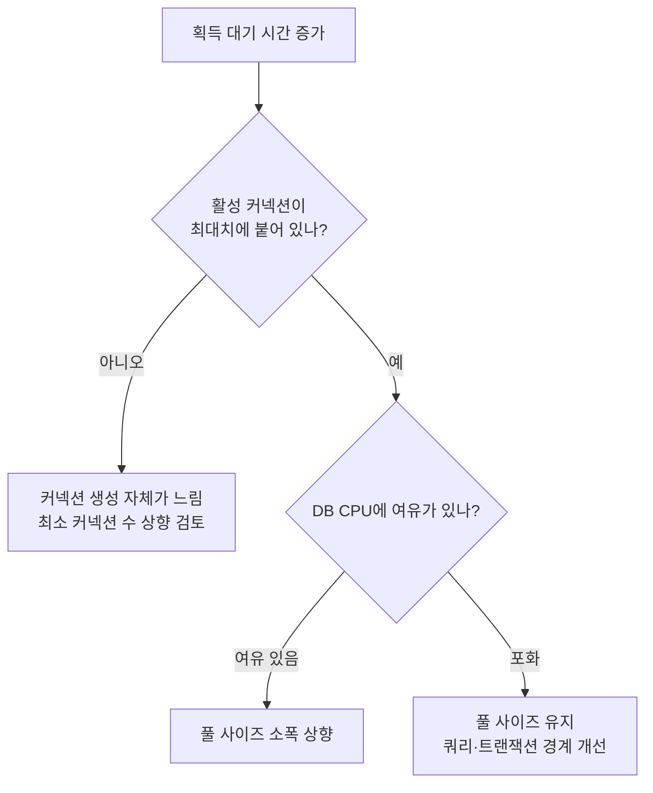

## 기본 개요

DB 커넥션의 생성은 성능적 비용이 많이 드는 작업이므로, 풀링(Pooling)을 통해 자원(커넥션)을 관리한다. 특히 DB 관점에서, 풀에 대한 커넥션 수와 같은 설정은 잘 알려진 공식이 존재하여 실무 상 활용되기도 한다.

이 어플리케이션 관점에서 DB 커넥션 풀 설정의 3가지 핵심 파라미터를 살펴본다. 각 값의 출발점을 어디서 가져올지 정리하고, 그 출발점을 검증과 개선으로 다듬어가는 현실적인 적용 방안에 대한 가이드라인을 제시한다.

## DB 커넥션 풀의 3가지 핵심 파라미터

### 커넥션 풀 사이즈(Connection Pool Size)

#### 파라미터

커넥션 풀링을 제공하는 라이브러리들은 이름은 달라도 대체로 아래 세 가지를 노출한다.

| 파라미터 | 의미 |
| --- | --- |
| 최대 커넥션 수 | 풀이 가질 수 있는 커넥션의 상한 |
| 최소 커넥션 수 | 유휴 상태에서도 유지하는 커넥션 수 |
| 초기 생성 커넥션 수 | 풀을 만드는 시점에 미리 맺어둘 커넥션 수 |

이 중 **초기 생성 수를 독립된 파라미터로 노출하는 구현체는 드물다.** 대부분은 요청이 들어온 시점에 커넥션을 만드는 지연 생성 방식이고, 이 경우 실질적인 초기 커넥션 수는 최소 커넥션 수가 결정한다.

주의할 점은 최소 커넥션 수의 기본값이다. **이 값이 최대 커넥션 수와 같게 잡혀 있는 구현체가 있어서, 아무것도 설정하지 않으면 부하와 무관하게 최대치를 계속 유지하는 고정 크기 풀이 된다.** 의도된 설계지만, 유휴 상태에서도 DB의 커넥션 슬롯을 점유한다는 뜻이므로 기본값을 확인하고 넘어가야 한다.

#### 출발점

커넥션 풀 사이즈의 초기 설정은 [PostgreSQL Wiki](https://wiki.postgresql.org/wiki/Number_Of_Database_Connections)에서 유래하여, [HikariCP 문서](https://github.com/brettwooldridge/HikariCP/wiki/About-Pool-Sizing)가 인용해 유명해진 아래 공식을 출발점으로 잡을 수 있다.

```
// DB 기준
connections = (core_count × 2) + effective_spindle_count
```

| 항목 | 의미 | 실무에서의 해석 |
| --- | --- | --- |
| `core_count` | **DB 서버**의 코어 수 (앱 서버가 아니다) | 앱 인스턴스 스펙과 무관하다 |
| `effective_spindle_count` | 디스크가 동시에 처리 가능한 I/O 개수 (≈ HDD 스핀들 수) | SSD·클라우드 스토리지에서는 사실상 무의미 |

이 때, 결과 값 `connections` 는 DB에 붙은 "active connections" 커넥션의 총량이다. 따라서 인스턴스의 풀은 아래와 같은 식을 참조할 수 있다.

- DB max_connections : `(DB 서버 코어 수 × 2) + 여유분`
- App max_connections : `min(concurrent_threads, DB max_connections / 인스턴스 수)`
- `Σ(각 인스턴스의 최대 풀 사이즈) < DB max_connections − 운영/모니터링 예약분`


### 커넥션 타임아웃(Connection Timeout)

#### 파라미터

"커넥션 타임아웃"이라는 이름으로 묶이지만, 실제로는 성격이 다른 세 가지가 있다. **이 셋을 구분하지 않으면 엉뚱한 값을 만지게 된다.**

| 구분 | 무엇을 제한하나 | 초과 시 |
| --- | --- | --- |
| 획득 타임아웃 | 풀에서 커넥션을 **얻기까지** 기다리는 시간 | 요청이 예외로 실패 |
| 유휴 타임아웃 | 안 쓰는 커넥션을 풀에 **놔두는** 시간 | 커넥션을 조용히 닫음 |
| 최대 수명 | 커넥션 하나의 **총 생존** 시간 | 반납 시점에 폐기 후 재생성 |

풀 사이즈·대기 큐와 엮이는 것은 **획득 타임아웃 하나뿐**이다. 나머지 둘은 DB 측 커넥션 정리 주기(`wait_timeout`, `idle_session_timeout`)나 로드밸런서의 유휴 연결 차단과 맞물리는 값이다.

기본값을 확인할 때 특히 주의할 것이 두 가지 있다.

- **획득 타임아웃의 기본값이 무제한인 구현체가 있다.** 이 경우 풀이 고갈되면 요청은 실패하지도 못하고 무한정 매달린다. 기본값을 믿지 말고 반드시 명시해야 하는 값이다.
- **획득 타임아웃이 독립된 파라미터가 아닌 경우가 있다.** 서버에 접속하는 대기와 풀에서 커넥션을 받는 대기를 하나의 값이 겸하기도 한다. 이때는 값을 조정해도 의도한 쪽에만 적용되지 않는다.

#### 출발점

**획득 타임아웃에는 계산 공식이 없다. 위에서 내려오는 제약으로 정한다.**

```
획득 타임아웃 < 상위 호출자의 타임아웃 (API 게이트웨이, 클라이언트, 사용자 응답 SLA)
```

이 부등호가 뒤집히면 최악의 조합이 된다. 클라이언트는 이미 연결을 끊었는데 서버는 그 사실을 모른 채 커넥션을 계속 붙잡고 기다린다. **아무도 기다리지 않는 응답을 위해 가장 귀한 자원을 점유하는 상태**이고, 이는 풀 고갈을 가속한다.

나머지 둘은 DB 쪽 설정에서 역산한다.

```
최대 수명 < DB의 커넥션 강제 종료 시간 (MySQL wait_timeout 등)
```

DB나 중간 네트워크 장비가 먼저 끊으면, 앱은 이미 죽은 커넥션을 살아있다고 믿고 꺼내 쓰다가 실패한다. **먼저 버리는 쪽이 앱이어야 한다.** 여러 풀링 구현체의 문서가 최대 수명을 DB 제한보다 몇 초 짧게 잡으라고 권하는 이유다.

### 대기 큐

#### 파라미터

앞의 두 값과 달리, **대기 큐는 대부분의 구현체에서 설정할 수 없다.** 큐 길이 제한을 노출하는 것은 DB 앞단에 두는 미들웨어형 풀러 정도이고, 애플리케이션 라이브러리는 대기 중인 요청 수를 **관측 지표로만** 제공하는 것이 보통이다.

즉 큐는 사실상 **무한대**이고, 유일한 상한은 앞 절의 획득 타임아웃이다. 그래서 대기 큐는 "설정하는 값"이 아니라 **"앞의 두 값이 만들어내는 결과"** 로 이해해야 한다.

무한 큐 자체가 문제는 아니다. 진짜 문제는 **무한 큐와 무제한 획득 타임아웃이 겹칠 때** 발생한다. 앞 절에서 본 대로 이 조합은 기본값만으로도 성립한다. 이때 요청은 실패하지도, 처리되지도 않은 채 쌓이기만 한다. 스레드와 메모리가 대기 중인 요청에 묶이고, 부하가 걷힌 뒤에도 밀린 요청이 한꺼번에 쏟아지며 회복을 방해한다.

#### 출발점

큐에 대해 정할 것은 길이가 아니라, **큐가 얼마나 길어졌을 때를 이상 신호로 볼 것인가**이다.

```
정상 상태의 대기 큐 길이 ≈ 0
```

풀이 적정하게 잡혀 있다면 대기 큐는 순간적인 스파이크에서만 잠깐 차오르고 곧 0으로 돌아온다. **대기 큐가 지속적으로 0보다 크다면 그 자체가 풀 사이즈나 쿼리 성능을 다시 봐야 한다는 신호다.** 이 값을 알림 기준으로 삼는 것이 큐를 다루는 실질적인 방법이다.

큐 길이를 제한할 수 있는 환경이라면, 상한은 앞의 두 값에서 유도한다.

```
큐 길이 상한 ≈ 풀 사이즈 × (획득 타임아웃 ÷ 평균 커넥션 점유 시간)
```

이 값을 넘는 길이의 큐는 **어차피 타임아웃 안에 소진될 수 없는 요청들**을 붙잡아두는 것뿐이다. 그럴 바에는 즉시 거절해 상위 계층이 재시도나 우회를 결정하게 하는 편이 낫다.

### 세 값은 하나의 동작을 기술한다

세 파라미터를 따로 설명했지만, 실제로는 커넥션 요청 하나가 지나가는 **같은 경로 위의 세 지점**이다.



- **풀 사이즈**는 새 커넥션을 만들지, 대기시킬지를 가른다.
- **대기 큐**는 대기시키기로 한 요청이 머무는 곳이다.
- **획득 타임아웃**은 그 대기를 언제 포기시킬지를 정한다.

그래서 세 값은 따로 정할 수 없다. 하나를 바꾸면 나머지 둘의 의미가 함께 바뀐다.

#### 세 값을 잇는 식

각 값의 출발점을 잡았다면, 아래 식으로 서로 모순되지 않는지 확인한다.

```
필요 커넥션 수 = TPS × 평균 커넥션 점유 시간   (Little's Law)
```

초당 200건을 처리하고 커넥션 하나를 평균 50ms 붙잡는다면 필요한 커넥션은 `200 × 0.05 = 10`개다. **이 식이 알려주는 핵심은, 점유 시간을 절반으로 줄이면 풀 사이즈를 두 배로 늘린 것과 같은 효과가 난다는 점이다.** 풀 사이즈는 늘릴수록 DB에 부담이 가지만, 점유 시간은 줄일수록 모두에게 이득이다. 이 비대칭이 뒤의 개선 단계 전체를 관통한다.

#### 정합성 점검

| 점검 항목 | 조건 |
| --- | --- |
| DB 상한 | `Σ(인스턴스 수 × 최대 풀 사이즈) < max_connections − 예약분` |
| 상위 타임아웃 | `획득 타임아웃 < 상위 호출자 타임아웃` |
| 커넥션 수명 | `최대 수명 < DB의 커넥션 강제 종료 시간` |
| 큐 대기 | `정상 상태의 대기 큐 길이 ≈ 0` |

여기까지가 **아직 트래픽을 받아보지 않은 상태에서 정할 수 있는 전부**다. 나머지는 실측으로 좁혀야 한다.

## 출발점 이후

### 검증: 부하 테스트로 가정 깨기

검증 단계의 목적은 값을 맞히는 것이 아니라, **출발점이 근거로 삼은 가정이 실제와 맞는지 확인하는 것**이다. 앞의 Little's Law에 실측값을 넣으면 필요 커넥션 수가 나오고, 이를 출발점과 대조한다.

부하를 단계적으로 올리며 관찰하면 병목이 어디인지 드러난다.

| 부하를 올릴 때 관찰되는 것 | 해석 | 조치 |
| --- | --- | --- |
| TPS 증가, 응답 시간 유지 | 아직 여유 있음 | 부하를 더 올린다 |
| TPS 정체, 획득 대기 증가, DB CPU 여유 | **풀이 병목** | 풀 사이즈를 올린다 |
| TPS 정체, DB CPU 포화 | **쿼리·DB가 병목** | 풀 사이즈는 그대로, 쿼리를 본다 |
| 풀을 늘려도 TPS 그대로 | 이미 DB 처리 한계 | 되돌린다 |

마지막 줄이 검증 단계에서 가장 중요하다. **풀 사이즈를 늘려도 TPS가 오르지 않는 지점이 존재하며, 그 지점을 넘긴 증설은 이득 없이 DB 부담만 늘린다.** 이 임계점을 찾는 것이 부하 테스트의 실질적인 목적이다.

조정은 한 번에 한 값만, 점진적으로 한다. 세 값이 서로 얽혀 있어서 두 개를 동시에 바꾸면 어느 쪽이 효과를 냈는지 알 수 없다.

### 개선: 운영 지표로 판단하기

계획과 검증은 **부하를 내가 만들어내는** 상황이었다. 개선은 **부하가 이미 주어진** 상황이며, 따라서 보는 것도 합성 부하가 아니라 운영 지표다.

| 지표 | 무엇을 말해주나 |
| --- | --- |
| 커넥션 획득 대기 시간 (p99) | 풀 포화의 1차 신호 |
| 획득 타임아웃 발생 횟수 | 이미 요청이 실패하고 있음 |
| 활성 / 유휴 커넥션 분포 | 풀이 실제로 다 쓰이고 있는지 |
| 커넥션 평균 점유 시간 | 원인이 풀 크기인지 쿼리인지 |

#### 풀 사이즈를 늘리기 전에

> **풀이 고갈됐을 때 풀 사이즈를 늘리는 것은 대개 오답이다.**

풀 고갈은 원인이 아니라 증상이다. 실제 원인은 대부분 커넥션 **점유 시간** 쪽에 있다. 느린 쿼리, 인덱스 누락, 트랜잭션 안에 들어간 외부 API 호출, N+1 조회. Little's Law가 보여준 대로 점유 시간과 필요 커넥션 수는 정비례하므로, 점유 시간이 늘어난 만큼 풀이 부족해 보이는 것뿐이다.

이때 풀을 늘리면 **빠른 실패가 DB 전체의 느린 붕괴로 바뀐다.** 대기가 앱의 큐에서 DB 내부의 경합으로 옮겨갈 뿐이고, 장애 범위는 한 서비스에서 그 DB를 공유하는 모든 서비스로 넓어진다.



#### 아무도 설정을 바꾸지 않았는데 값이 바뀐다

운영 단계에서만 생기는 문제가 하나 있다. **오토스케일링은 설정 파일을 건드리지 않고도 총 커넥션 수를 바꾼다.**

앞서 본 합산 제약을 다시 보자.

```
Σ(인스턴스 수 × 최대 풀 사이즈) < max_connections − 예약분
```

계획 단계에서 이 식의 `인스턴스 수`는 고정된 상수였다. 운영 단계에서는 **트래픽에 따라 움직이는 변수**다. 인스턴스당 20개로 잡아둔 풀이 스케일아웃으로 10대에서 30대가 되면 총 커넥션은 200에서 600으로 뛴다. 정작 이 일은 트래픽이 몰려 DB도 함께 힘든 시점에 일어난다.

따라서 개선 단계에서는 풀 사이즈를 단독으로 보지 말고, **오토스케일링 최대 대수와 곱한 값**을 DB 상한과 대조해야 한다. 앱이 늘어나는 만큼 인스턴스당 풀은 줄여 잡거나, PgBouncer 같은 중간 계층을 두어 DB에 붙는 실제 커넥션 수를 고정하는 방법을 검토한다.

## 정리

값을 정할 때 순서대로 확인할 것.

1. **풀 사이즈** — `DB 코어 수 × 2`에서 출발한다. 구현체 기본값보다 작은 경우가 많다.
2. **합산 제약** — 인스턴스 수를 곱한 총량이 `max_connections`를 넘지 않는지 본다. 오토스케일링 최대 대수 기준으로 계산한다.
3. **획득 타임아웃** — 상위 호출자의 타임아웃보다 짧게 잡는다. 무제한이 기본값인 구현체가 있으니 반드시 확인한다.
4. **최대 수명** — DB가 커넥션을 강제 종료하는 시간보다 짧게 잡는다. 먼저 버리는 쪽이 앱이어야 한다.
5. **대기 큐** — 설정값이 아니라 관측 대상이다. 정상 상태에서 0이 아니라면 앞의 값들을 다시 본다.
6. **고갈되면 늘리기 전에 점유 시간부터** — 풀 고갈은 증상이고, 원인은 대개 쿼리와 트랜잭션 경계에 있다.
