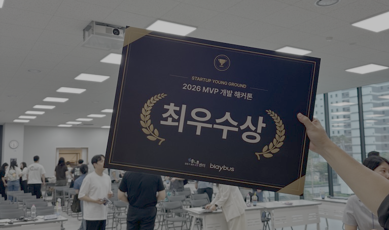

8월 초부터 약 3주 간 달려온 해커톤을 마쳤다.

주어진 창업자 요구사항들을 토대로 MVP를 구현하란 것이 주제의 골자였다.
개인으로 참가했던 나는 같은 개인 참가자 2명을 더 모아 팀을 꾸렸다. 
하여 다른 160명을 상대로 2등 상인 최우수상을 거두었다.

대학생 이후로 처음 나서본 해커톤이다.
나름 여러 해커톤을 경험했었지만 7년이란게 작은 시간은 아닌가보다. 
많이 달라진 요즈음이 새삼 적잖이 놀랍다. 그리고 그 중심에는 역시 AI가 있었다.

## 바이브코더

스스로를 바이브코더라 소개하는 이들을 여럿 만났다. 중년부터 대학생까지 다양하다.
중도 포기하셨지만, 바이브코더 한 분을 4번째 팀원으로 모시기도 했다.
개발자들에게 "코더"란 단어가 멸칭 중 하나였기 때문일까, 아니면 유튜브 발 마케팅 용어이기 때문일까.
그 배경을 알고 계신지는 조심스러워 묻지 못했으나, 좌우간 바이브코더라는 소개는 
취미개발자 혹은 전직을 원하는 예비개발자들의 오묘한, 한국식 겸손의 표현이 되어있었다.

AI 를 교두보로 그만큼 취미개발자가 많아졌다는 이야기가 될 것이다.
한때 바이브코더란 용어를 무책임한 개발자로만 읽어왔었다. 아마 내가 개발자이기에 세상 모든 개발자는 프로, 혹은 프로 지망생임을 전제하여 생긴 오류일 것이다. 이 오류가 실제 바이브코더들을 만나며 고쳐진 셈이다. 나아가 바이브코더 분들은 요구사항에 맞춰 MVP 를 훌륭히 제출했고, 개인으로 참가한 한 명은 수상까지 이루어냈다.

## 팀원으로서의 바이브코더

물론 한계는 있다. 가장 큰 한계는 역시 소통이 어렵다는 점. 
시스템이 커지고 도메인이 많아질수록 사람도 AI 도 그 맥락을 유지하기 힘들다.
분업이 필요하단 이야기다. 해커톤에서 구성한 작은 시스템에서조차
간단한 용어나 기술개념, 아키텍팅의 기초부터 설명해야하는 일이 필요했고, 이는 매우 고된 일이었다.
아마 그들에게도 고된 일이었으리라. 바이브코더가 궁금했고 함께 작업해보고 싶었던 팀장으로서 최선을 다했지만, 바이브코더였던 4번째 팀원을 그렇게 잃을 수밖에 없었다.

이 해커톤에 참가한 이유는 기술적인 경험이 아니었다. 처음보는 팀원을 현장에서 꾸리고, 리딩하며 리더로서의 역량을 확인하고자 함이 중요했다. 미리 구성된 팀들이 많았기에 인력풀이 넓지 않았지만, 어렵사리 그렇게 4인의 팀을 만들게 된 것이다.

스스로 민폐인 것 같다며 남긴 슬랙 메세지가 마음에 걸린다. 혹시 내가 참가 포기를 강요하게 된 셈이 아닐까. 함께할 수 있었던 방법은 없었던 것일까.
필요에 맞게 적절한 인력을 구하는 것이 가장 좋겠지만, 그것이 사람을 골라 사귐과 무엇이 다르겠는가. 하물며 그 적절하단 내 판단조차 옳아봐야 다 옳겠는가.

구현 책임을 분리하거나, 아예 다른 직군으로 유도하는 것이 맞았다고 회고한다.
아키텍팅이나 기술적 설계에 참여시키며, 개념적인 이해를 요구하는 업무를 부여한 것은
바이브코더라는 그 소개와 소개에 숨은 의도를 무시하는 일이 아니었을까라고 회고한다.
오히려 창의성을 요하는 기획적인 임무를 논의하는 것이 좋은 방향이지 않았을까?

그리고 그러한 모든 추측과 가정이 발생한 이유는 결국,
당사자에게 당사자가 원하는 일을 확실하게 묻는 과정을 생략했기 때문일 것이다.

## 마무리

중요한 것들을 하나씩 잃어가는 삶에서 그 중 하나였던 개발마저 빼앗길 것만 같던 요즘, 이젠 그 열정마저 식으려는가 싶었다.
비단 스스로 고쳐야할 점이 있었지만, 누군가와 무언가를 만든 경험은 오랜 가뭄에 단비와도 같은 즐거움이었다.
아직 나는 개발과 그 과정 자체를 좋아하고 있구나하며 안심이 든다.
